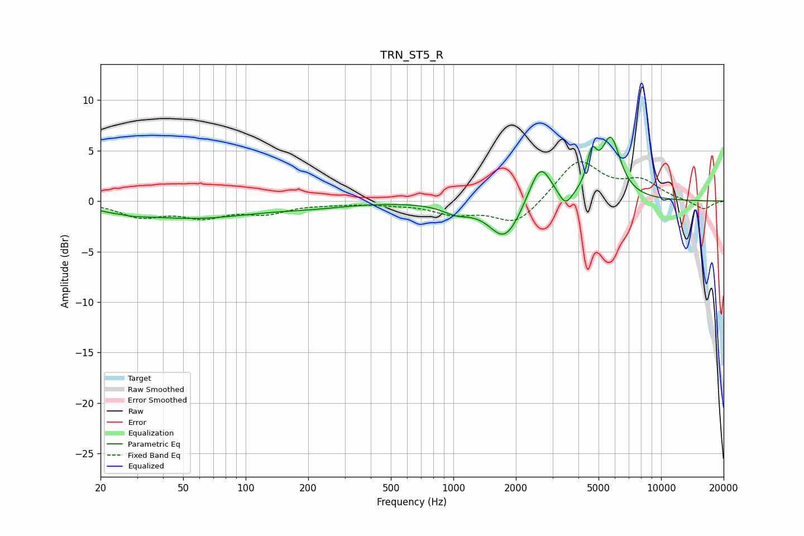

# TRN_ST5_R
See [usage instructions](https://github.com/jaakkopasanen/AutoEq#usage) for more options and info.

### Parametric EQs
Apply preamp of -6.4 dB when using parametric equalizer.

|   # | Type    |   Fc (Hz) |    Q |   Gain (dB) |
|-----|---------|-----------|------|-------------|
|   1 | Peaking |        22 | 3.47 |        -0.1 |
|   2 | Peaking |        28 | 2.04 |        -0.3 |
|   3 | Peaking |        55 | 0.47 |        -1.6 |
|   4 | Peaking |       210 | 0.81 |        -0.4 |
|   5 | Peaking |      1033 | 2.1  |        -0.9 |
|   6 | Peaking |      1772 | 1.87 |        -3.9 |
|   7 | Peaking |      2618 | 2.63 |         4   |
|   8 | Peaking |      3462 | 4.41 |        -1.5 |
|   9 | Peaking |      4641 | 5.89 |         3.3 |
|  10 | Peaking |      5726 | 2.92 |         5.9 |

### Fixed Band EQs
When using fixed band (also called graphic) equalizer, apply preamp of **-4.0 dB** (if available) and set gains manually with these parameters.

|   # | Type    |   Fc (Hz) |    Q |   Gain (dB) |
|-----|---------|-----------|------|-------------|
|   1 | Peaking |        31 | 1.41 |        -1.4 |
|   2 | Peaking |        62 | 1.41 |        -1.4 |
|   3 | Peaking |       125 | 1.41 |        -1.1 |
|   4 | Peaking |       250 | 1.41 |        -0.2 |
|   5 | Peaking |       500 | 1.41 |        -0.2 |
|   6 | Peaking |      1000 | 1.41 |        -1.1 |
|   7 | Peaking |      2000 | 1.41 |        -2.4 |
|   8 | Peaking |      4000 | 1.41 |         4.1 |
|   9 | Peaking |      8000 | 1.41 |         1.8 |
|  10 | Peaking |     16000 | 1.41 |        -0.9 |

### Graphs

