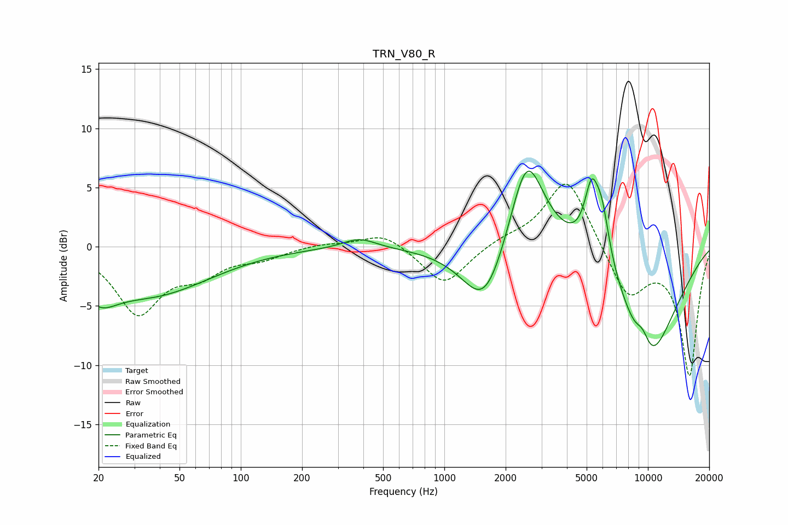

# TRN_V80_R
See [usage instructions](https://github.com/jaakkopasanen/AutoEq#usage) for more options and info.

### Parametric EQs
Apply preamp of -6.5 dB when using parametric equalizer.

|   # | Type    |   Fc (Hz) |    Q |   Gain (dB) |
|-----|---------|-----------|------|-------------|
|   1 | Peaking |        20 | 1.64 |        -2.3 |
|   2 | Peaking |        36 | 0.48 |        -3.9 |
|   3 | Peaking |       383 | 1.7  |         0.9 |
|   4 | Peaking |      1588 | 1.28 |        -5.9 |
|   5 | Peaking |      2536 | 1.58 |         8.8 |
|   6 | Peaking |      5283 | 3.89 |         4.9 |
|   7 | Peaking |      5949 | 3.7  |         3.9 |
|   8 | Peaking |      7331 | 0.62 |         3.6 |
|   9 | Peaking |      9424 | 3.29 |         2   |
|  10 | Peaking |      9751 | 0.78 |       -12.7 |

### Fixed Band EQs
When using fixed band (also called graphic) equalizer, apply preamp of **-5.4 dB** (if available) and set gains manually with these parameters.

|   # | Type    |   Fc (Hz) |    Q |   Gain (dB) |
|-----|---------|-----------|------|-------------|
|   1 | Peaking |        31 | 1.41 |        -5.5 |
|   2 | Peaking |        62 | 1.41 |        -1.9 |
|   3 | Peaking |       125 | 1.41 |        -0.8 |
|   4 | Peaking |       250 | 1.41 |         0.3 |
|   5 | Peaking |       500 | 1.41 |         1.3 |
|   6 | Peaking |      1000 | 1.41 |        -3.3 |
|   7 | Peaking |      2000 | 1.41 |         0.6 |
|   8 | Peaking |      4000 | 1.41 |         6   |
|   9 | Peaking |      8000 | 1.41 |        -4.2 |
|  10 | Peaking |     16000 | 1.41 |       -10.8 |

### Graphs

