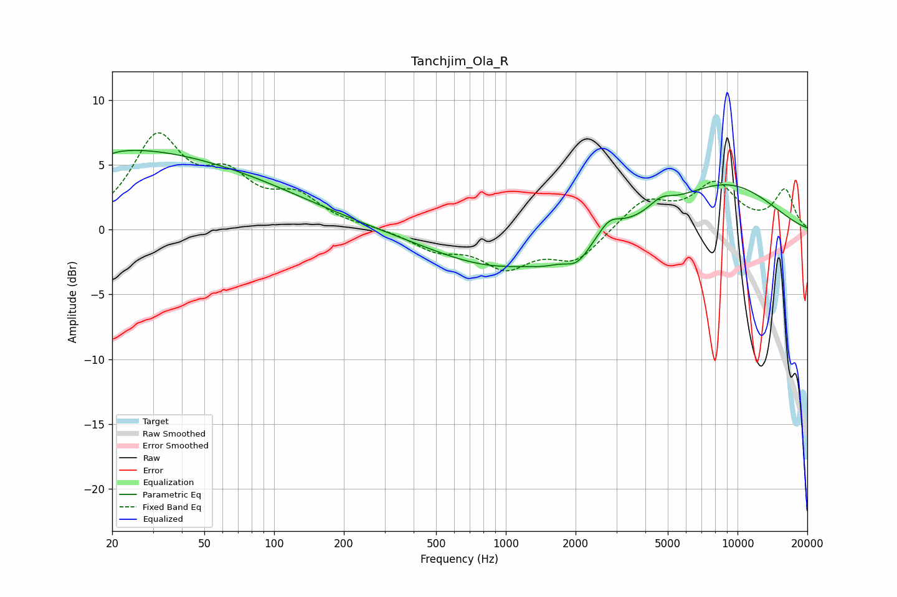

# Tanchjim_Ola_R
See [usage instructions](https://github.com/jaakkopasanen/AutoEq#usage) for more options and info.

### Parametric EQs
Apply preamp of -6.2 dB when using parametric equalizer.

|   # | Type    |   Fc (Hz) |    Q |   Gain (dB) |
|-----|---------|-----------|------|-------------|
|   1 | Peaking |        20 | 5.83 |        -3.5 |
|   2 | Peaking |        20 | 5.89 |         3.3 |
|   3 | Peaking |        23 | 0.5  |         1   |
|   4 | Peaking |        25 | 0.2  |         5.2 |
|   5 | Peaking |       933 | 0.49 |        -2.9 |
|   6 | Peaking |      1484 | 1.95 |        -0.5 |
|   7 | Peaking |      2031 | 2.55 |        -1.4 |
|   8 | Peaking |      2795 | 2.96 |         1.1 |
|   9 | Peaking |      4667 | 2.76 |         0.8 |
|  10 | Peaking |      8729 | 0.53 |         3.5 |

### Fixed Band EQs
When using fixed band (also called graphic) equalizer, apply preamp of **-7.6 dB** (if available) and set gains manually with these parameters.

|   # | Type    |   Fc (Hz) |    Q |   Gain (dB) |
|-----|---------|-----------|------|-------------|
|   1 | Peaking |        31 | 1.41 |         6.8 |
|   2 | Peaking |        62 | 1.41 |         3.3 |
|   3 | Peaking |       125 | 1.41 |         2.2 |
|   4 | Peaking |       250 | 1.41 |         0.1 |
|   5 | Peaking |       500 | 1.41 |        -1.4 |
|   6 | Peaking |      1000 | 1.41 |        -2.6 |
|   7 | Peaking |      2000 | 1.41 |        -2.3 |
|   8 | Peaking |      4000 | 1.41 |         2.2 |
|   9 | Peaking |      8000 | 1.41 |         3.3 |
|  10 | Peaking |     16000 | 1.41 |         3   |

### Graphs

