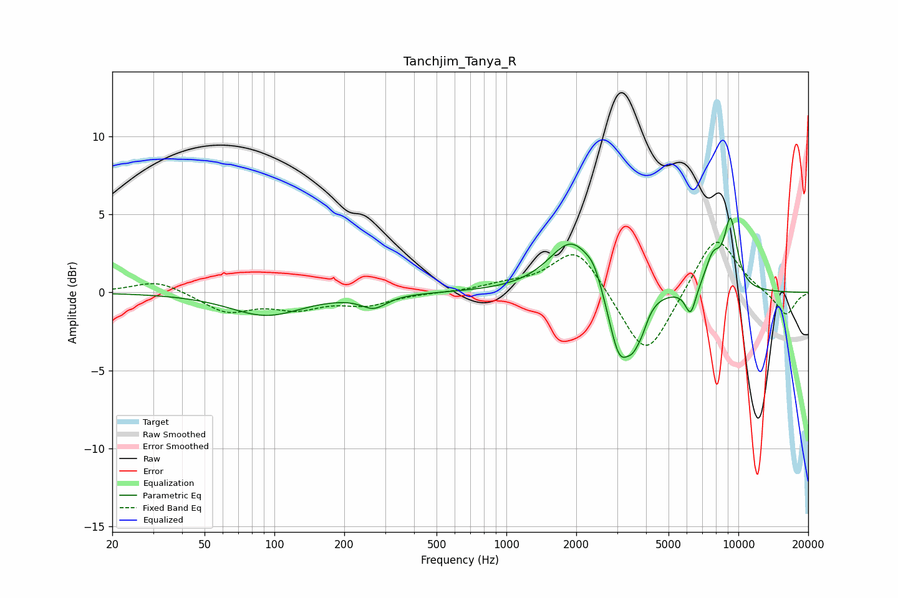

# Tanchjim_Tanya_R
See [usage instructions](https://github.com/jaakkopasanen/AutoEq#usage) for more options and info.

### Parametric EQs
Apply preamp of -4.9 dB when using parametric equalizer.

|   # | Type    |   Fc (Hz) |    Q |   Gain (dB) |
|-----|---------|-----------|------|-------------|
|   1 | Peaking |        92 | 0.91 |        -1.5 |
|   2 | Peaking |       269 | 2.57 |        -0.8 |
|   3 | Peaking |      1927 | 1.43 |         3.5 |
|   4 | Peaking |      2387 | 4.31 |         0.8 |
|   5 | Peaking |      3074 | 2.83 |        -4.7 |
|   6 | Peaking |      3526 | 4.83 |        -1.4 |
|   7 | Peaking |      3844 | 5.23 |        -1   |
|   8 | Peaking |      6225 | 5.86 |        -1.7 |
|   9 | Peaking |      7768 | 3.73 |         2   |
|  10 | Peaking |      9257 | 4.52 |         4.3 |

### Fixed Band EQs
When using fixed band (also called graphic) equalizer, apply preamp of **-3.3 dB** (if available) and set gains manually with these parameters.

|   # | Type    |   Fc (Hz) |    Q |   Gain (dB) |
|-----|---------|-----------|------|-------------|
|   1 | Peaking |        31 | 1.41 |         0.8 |
|   2 | Peaking |        62 | 1.41 |        -1.2 |
|   3 | Peaking |       125 | 1.41 |        -0.9 |
|   4 | Peaking |       250 | 1.41 |        -0.7 |
|   5 | Peaking |       500 | 1.41 |        -0   |
|   6 | Peaking |      1000 | 1.41 |         0.4 |
|   7 | Peaking |      2000 | 1.41 |         3   |
|   8 | Peaking |      4000 | 1.41 |        -4.5 |
|   9 | Peaking |      8000 | 1.41 |         3.8 |
|  10 | Peaking |     16000 | 1.41 |        -1.5 |

### Graphs

