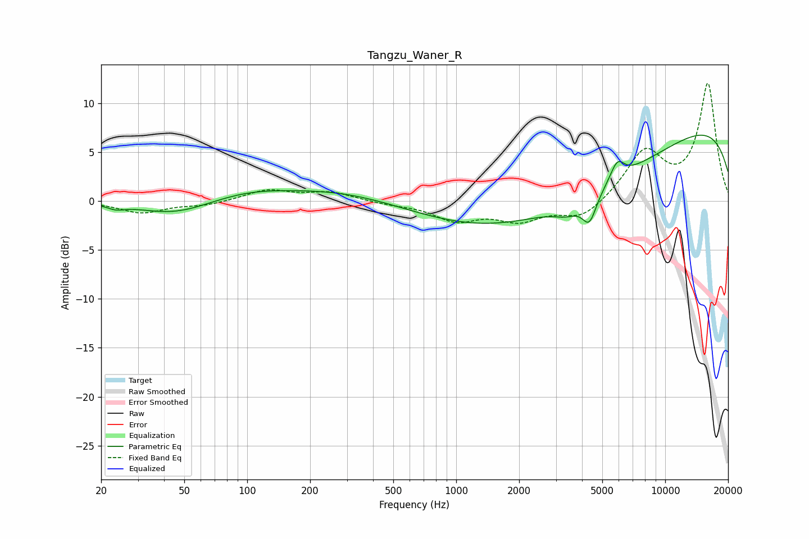

# Tangzu_Waner_R
See [usage instructions](https://github.com/jaakkopasanen/AutoEq#usage) for more options and info.

### Parametric EQs
Apply preamp of -6.8 dB when using parametric equalizer.

|   # | Type    |   Fc (Hz) |    Q |   Gain (dB) |
|-----|---------|-----------|------|-------------|
|   1 | Peaking |        24 | 3.63 |        -0.4 |
|   2 | Peaking |        45 | 0.82 |        -1.4 |
|   3 | Peaking |       100 | 0.72 |         0.9 |
|   4 | Peaking |       278 | 0.5  |         1.1 |
|   5 | Peaking |      3218 | 0.22 |        -4.9 |
|   6 | Peaking |      3387 | 2.24 |        -1   |
|   7 | Peaking |      3703 | 0.42 |        -1.8 |
|   8 | Peaking |      4337 | 4.1  |        -2.8 |
|   9 | Peaking |      5900 | 4.08 |         2   |
|  10 | Peaking |     10000 | 0.19 |         9.1 |

### Fixed Band EQs
When using fixed band (also called graphic) equalizer, apply preamp of **-12.1 dB** (if available) and set gains manually with these parameters.

|   # | Type    |   Fc (Hz) |    Q |   Gain (dB) |
|-----|---------|-----------|------|-------------|
|   1 | Peaking |        31 | 1.41 |        -1.2 |
|   2 | Peaking |        62 | 1.41 |        -0.4 |
|   3 | Peaking |       125 | 1.41 |         1.1 |
|   4 | Peaking |       250 | 1.41 |         0.9 |
|   5 | Peaking |       500 | 1.41 |        -0.3 |
|   6 | Peaking |      1000 | 1.41 |        -1.8 |
|   7 | Peaking |      2000 | 1.41 |        -1.8 |
|   8 | Peaking |      4000 | 1.41 |        -1.8 |
|   9 | Peaking |      8000 | 1.41 |         4.9 |
|  10 | Peaking |     16000 | 1.41 |        11.9 |

### Graphs

