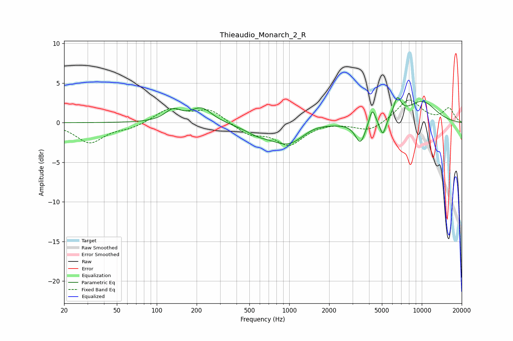

# Thieaudio_Monarch_2_R
See [usage instructions](https://github.com/jaakkopasanen/AutoEq#usage) for more options and info.

### Parametric EQs
Apply preamp of -3.3 dB when using parametric equalizer.

|   # | Type    |   Fc (Hz) |    Q |   Gain (dB) |
|-----|---------|-----------|------|-------------|
|   1 | Peaking |       133 | 2.34 |         1.4 |
|   2 | Peaking |       218 | 1.79 |         1.8 |
|   3 | Peaking |       576 | 1.47 |        -0.8 |
|   4 | Peaking |       994 | 1.04 |        -2.8 |
|   5 | Peaking |      1484 | 1.28 |         0.7 |
|   6 | Peaking |      3442 | 3.72 |        -2.7 |
|   7 | Peaking |      4228 | 6    |         2.1 |
|   8 | Peaking |      5081 | 5.98 |        -2.1 |
|   9 | Peaking |      6539 | 4.93 |         2.3 |
|  10 | Peaking |     10000 | 1.03 |         2.7 |

### Fixed Band EQs
When using fixed band (also called graphic) equalizer, apply preamp of **-3.0 dB** (if available) and set gains manually with these parameters.

|   # | Type    |   Fc (Hz) |    Q |   Gain (dB) |
|-----|---------|-----------|------|-------------|
|   1 | Peaking |        31 | 1.41 |        -2.5 |
|   2 | Peaking |        62 | 1.41 |        -0.6 |
|   3 | Peaking |       125 | 1.41 |         1.7 |
|   4 | Peaking |       250 | 1.41 |         1.7 |
|   5 | Peaking |       500 | 1.41 |        -1.4 |
|   6 | Peaking |      1000 | 1.41 |        -2.7 |
|   7 | Peaking |      2000 | 1.41 |         0.1 |
|   8 | Peaking |      4000 | 1.41 |        -1.1 |
|   9 | Peaking |      8000 | 1.41 |         2.9 |
|  10 | Peaking |     16000 | 1.41 |         1.8 |

### Graphs

