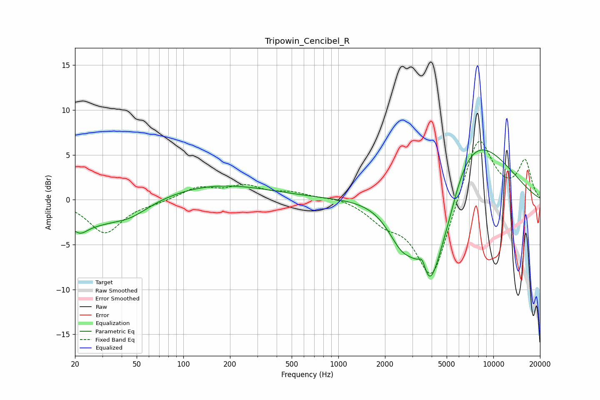

# Tripowin_Cencibel_R
See [usage instructions](https://github.com/jaakkopasanen/AutoEq#usage) for more options and info.

### Parametric EQs
Apply preamp of -5.6 dB when using parametric equalizer.

|   # | Type    |   Fc (Hz) |    Q |   Gain (dB) |
|-----|---------|-----------|------|-------------|
|   1 | Peaking |        20 | 0.6  |        -3.1 |
|   2 | Peaking |        22 | 5.62 |        -3.3 |
|   3 | Peaking |        22 | 6    |         2.7 |
|   4 | Peaking |        46 | 1.17 |        -1.2 |
|   5 | Peaking |       166 | 0.41 |         1.7 |
|   6 | Peaking |      2585 | 1.4  |        -4.8 |
|   7 | Peaking |      3483 | 6    |         1.6 |
|   8 | Peaking |      3889 | 1.61 |       -10.8 |
|   9 | Peaking |      5023 | 1.68 |        -3.5 |
|  10 | Peaking |      6786 | 0.52 |         8.2 |

### Fixed Band EQs
When using fixed band (also called graphic) equalizer, apply preamp of **-6.6 dB** (if available) and set gains manually with these parameters.

|   # | Type    |   Fc (Hz) |    Q |   Gain (dB) |
|-----|---------|-----------|------|-------------|
|   1 | Peaking |        31 | 1.41 |        -3.7 |
|   2 | Peaking |        62 | 1.41 |        -0.3 |
|   3 | Peaking |       125 | 1.41 |         1.3 |
|   4 | Peaking |       250 | 1.41 |         1.4 |
|   5 | Peaking |       500 | 1.41 |         0.7 |
|   6 | Peaking |      1000 | 1.41 |         0.4 |
|   7 | Peaking |      2000 | 1.41 |        -1.9 |
|   8 | Peaking |      4000 | 1.41 |        -9.1 |
|   9 | Peaking |      8000 | 1.41 |         7.7 |
|  10 | Peaking |     16000 | 1.41 |         4.2 |

### Graphs

