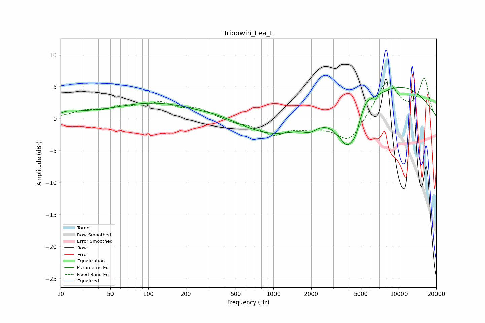

# Tripowin_Lea_L
See [usage instructions](https://github.com/jaakkopasanen/AutoEq#usage) for more options and info.

### Parametric EQs
Apply preamp of -5.0 dB when using parametric equalizer.

|   # | Type    |   Fc (Hz) |    Q |   Gain (dB) |
|-----|---------|-----------|------|-------------|
|   1 | Peaking |        22 | 4.23 |         0.3 |
|   2 | Peaking |        27 | 1.12 |         0.5 |
|   3 | Peaking |       114 | 0.41 |         2.5 |
|   4 | Peaking |       342 | 1.32 |         0.3 |
|   5 | Peaking |      1013 | 0.6  |        -2.5 |
|   6 | Peaking |      1948 | 2.7  |        -0.9 |
|   7 | Peaking |      3899 | 1.87 |        -5.9 |
|   8 | Peaking |      4537 | 4.39 |        -1.5 |
|   9 | Peaking |      5447 | 3.2  |         1.1 |
|  10 | Peaking |      9683 | 0.38 |         5.1 |

### Fixed Band EQs
When using fixed band (also called graphic) equalizer, apply preamp of **-6.4 dB** (if available) and set gains manually with these parameters.

|   # | Type    |   Fc (Hz) |    Q |   Gain (dB) |
|-----|---------|-----------|------|-------------|
|   1 | Peaking |        31 | 1.41 |         1   |
|   2 | Peaking |        62 | 1.41 |         1.6 |
|   3 | Peaking |       125 | 1.41 |         2.2 |
|   4 | Peaking |       250 | 1.41 |         1.4 |
|   5 | Peaking |       500 | 1.41 |        -0.6 |
|   6 | Peaking |      1000 | 1.41 |        -2.3 |
|   7 | Peaking |      2000 | 1.41 |        -1   |
|   8 | Peaking |      4000 | 1.41 |        -3.7 |
|   9 | Peaking |      8000 | 1.41 |         5.9 |
|  10 | Peaking |     16000 | 1.41 |         6.1 |

### Graphs

