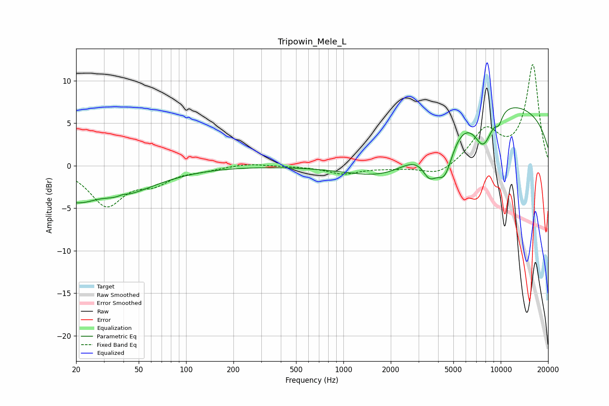

# Tripowin_Mele_L
See [usage instructions](https://github.com/jaakkopasanen/AutoEq#usage) for more options and info.

### Parametric EQs
Apply preamp of -6.9 dB when using parametric equalizer.

|   # | Type    |   Fc (Hz) |    Q |   Gain (dB) |
|-----|---------|-----------|------|-------------|
|   1 | Peaking |        25 | 0.47 |        -5   |
|   2 | Peaking |        28 | 1.56 |         1   |
|   3 | Peaking |        40 | 5.58 |         0.2 |
|   4 | Peaking |      2077 | 0.6  |        -4   |
|   5 | Peaking |      3524 | 2.94 |        -2.9 |
|   6 | Peaking |      4401 | 2.44 |        -5.1 |
|   7 | Peaking |      5841 | 0.38 |         2.2 |
|   8 | Peaking |      7755 | 2.13 |        -4.6 |
|   9 | Peaking |      9728 | 5.61 |        -1.2 |
|  10 | Peaking |     10000 | 0.2  |         6.5 |

### Fixed Band EQs
When using fixed band (also called graphic) equalizer, apply preamp of **-12.0 dB** (if available) and set gains manually with these parameters.

|   # | Type    |   Fc (Hz) |    Q |   Gain (dB) |
|-----|---------|-----------|------|-------------|
|   1 | Peaking |        31 | 1.41 |        -4.5 |
|   2 | Peaking |        62 | 1.41 |        -1.7 |
|   3 | Peaking |       125 | 1.41 |        -0.4 |
|   4 | Peaking |       250 | 1.41 |         0.3 |
|   5 | Peaking |       500 | 1.41 |        -0   |
|   6 | Peaking |      1000 | 1.41 |        -0.9 |
|   7 | Peaking |      2000 | 1.41 |        -0.2 |
|   8 | Peaking |      4000 | 1.41 |        -1.3 |
|   9 | Peaking |      8000 | 1.41 |         4   |
|  10 | Peaking |     16000 | 1.41 |        11.8 |

### Graphs

