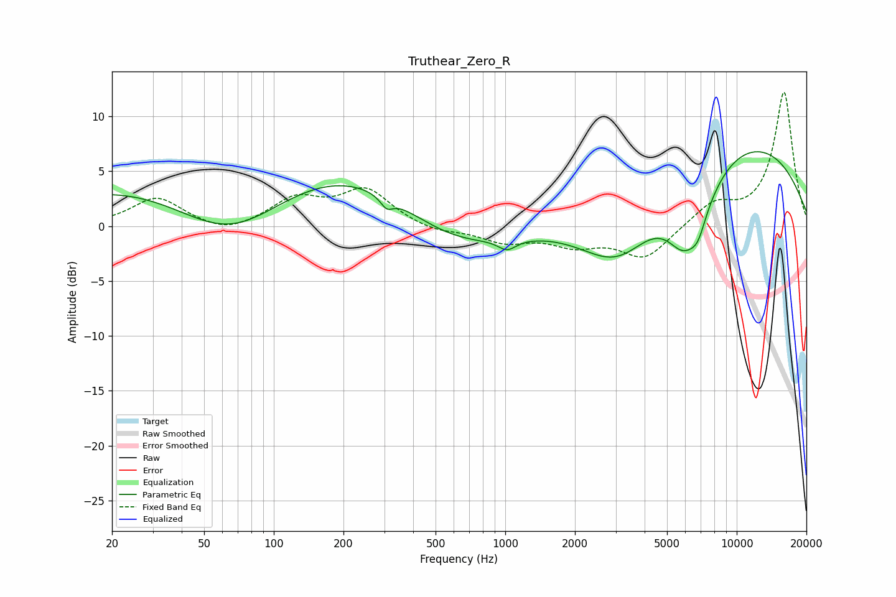

# Truthear_Zero_R
See [usage instructions](https://github.com/jaakkopasanen/AutoEq#usage) for more options and info.

### Parametric EQs
Apply preamp of -6.9 dB when using parametric equalizer.

|   # | Type    |   Fc (Hz) |    Q |   Gain (dB) |
|-----|---------|-----------|------|-------------|
|   1 | Peaking |        65 | 0.44 |       -10.6 |
|   2 | Peaking |        86 | 0.18 |        11.2 |
|   3 | Peaking |       307 | 5.29 |        -1   |
|   4 | Peaking |       566 | 0.54 |        -4.5 |
|   5 | Peaking |      1019 | 3.62 |        -1   |
|   6 | Peaking |      3081 | 0.76 |        -7.3 |
|   7 | Peaking |      5904 | 1.78 |        -4.8 |
|   8 | Peaking |      6805 | 3.98 |        -1.6 |
|   9 | Peaking |      6966 | 1.28 |        -2.3 |
|  10 | Peaking |      8491 | 0.25 |         8.7 |

### Fixed Band EQs
When using fixed band (also called graphic) equalizer, apply preamp of **-12.3 dB** (if available) and set gains manually with these parameters.

|   # | Type    |   Fc (Hz) |    Q |   Gain (dB) |
|-----|---------|-----------|------|-------------|
|   1 | Peaking |        31 | 1.41 |         2.6 |
|   2 | Peaking |        62 | 1.41 |        -0.9 |
|   3 | Peaking |       125 | 1.41 |         2.4 |
|   4 | Peaking |       250 | 1.41 |         3.2 |
|   5 | Peaking |       500 | 1.41 |        -0.6 |
|   6 | Peaking |      1000 | 1.41 |        -1.3 |
|   7 | Peaking |      2000 | 1.41 |        -1.5 |
|   8 | Peaking |      4000 | 1.41 |        -2.9 |
|   9 | Peaking |      8000 | 1.41 |         2   |
|  10 | Peaking |     16000 | 1.41 |        12.2 |

### Graphs

