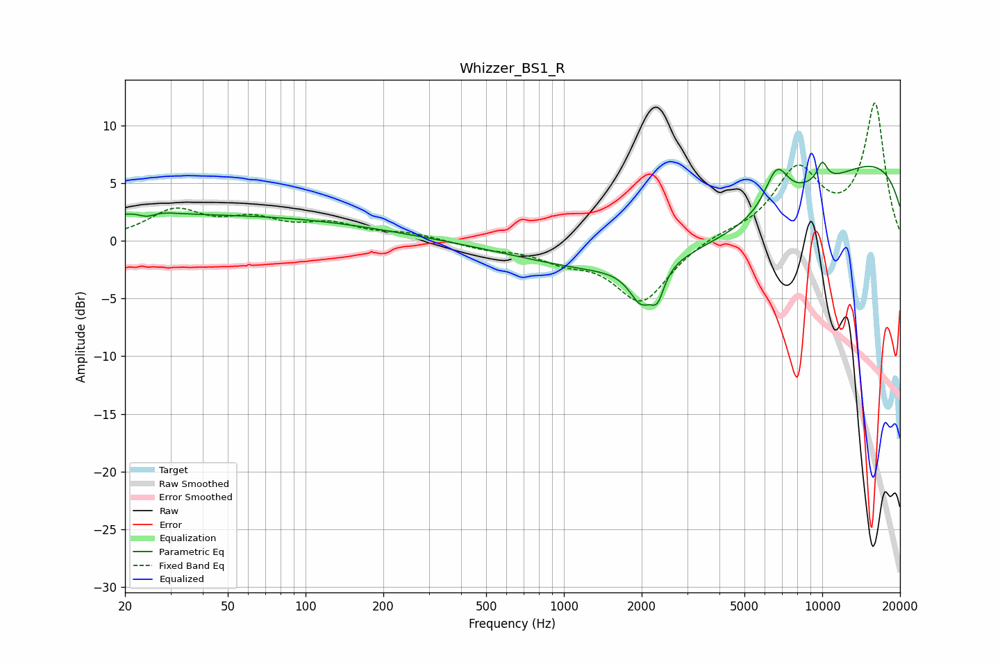

# Whizzer_BS1_R
See [usage instructions](https://github.com/jaakkopasanen/AutoEq#usage) for more options and info.

### Parametric EQs
Apply preamp of -6.9 dB when using parametric equalizer.

|   # | Type    |   Fc (Hz) |    Q |   Gain (dB) |
|-----|---------|-----------|------|-------------|
|   1 | Peaking |        24 | 2.14 |         0.8 |
|   2 | Peaking |        24 | 3.72 |        -0.9 |
|   3 | Peaking |        37 | 0.18 |         2.2 |
|   4 | Peaking |      1991 | 3.12 |        -3.1 |
|   5 | Peaking |      2303 | 5.58 |        -2.2 |
|   6 | Peaking |      3767 | 0.26 |        -7.5 |
|   7 | Peaking |      6665 | 2.91 |         3.6 |
|   8 | Peaking |      9031 | 1.8  |         0.3 |
|   9 | Peaking |      9657 | 0.18 |         9.4 |
|  10 | Peaking |     10000 | 6    |         1.7 |

### Fixed Band EQs
When using fixed band (also called graphic) equalizer, apply preamp of **-12.0 dB** (if available) and set gains manually with these parameters.

|   # | Type    |   Fc (Hz) |    Q |   Gain (dB) |
|-----|---------|-----------|------|-------------|
|   1 | Peaking |        31 | 1.41 |         2.5 |
|   2 | Peaking |        62 | 1.41 |         1.6 |
|   3 | Peaking |       125 | 1.41 |         1.3 |
|   4 | Peaking |       250 | 1.41 |         0.6 |
|   5 | Peaking |       500 | 1.41 |        -0.6 |
|   6 | Peaking |      1000 | 1.41 |        -1.3 |
|   7 | Peaking |      2000 | 1.41 |        -5.2 |
|   8 | Peaking |      4000 | 1.41 |         0.5 |
|   9 | Peaking |      8000 | 1.41 |         5.9 |
|  10 | Peaking |     16000 | 1.41 |        11.7 |

### Graphs

