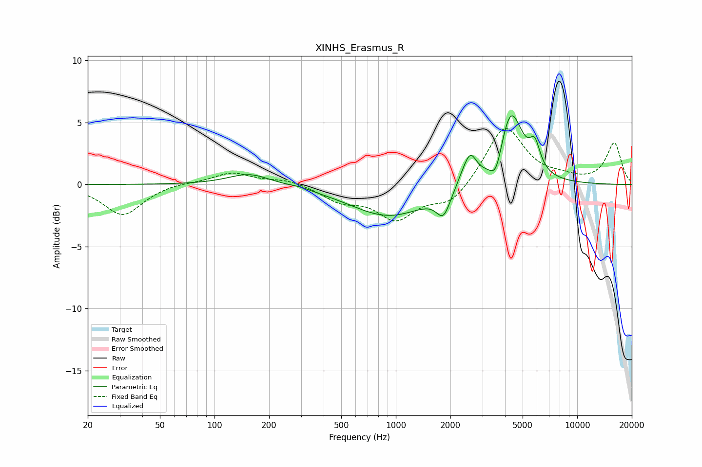

# XINHS_Erasmus_R
See [usage instructions](https://github.com/jaakkopasanen/AutoEq#usage) for more options and info.

### Parametric EQs
Apply preamp of -5.6 dB when using parametric equalizer.

|   # | Type    |   Fc (Hz) |    Q |   Gain (dB) |
|-----|---------|-----------|------|-------------|
|   1 | Peaking |       156 | 1.22 |         1   |
|   2 | Peaking |       298 | 2.45 |         0.1 |
|   3 | Peaking |       916 | 0.65 |        -2.5 |
|   4 | Peaking |      1824 | 3.85 |        -1.5 |
|   5 | Peaking |      1867 | 3.21 |        -0.4 |
|   6 | Peaking |      2341 | 3.24 |         0.7 |
|   7 | Peaking |      2578 | 3.99 |         2   |
|   8 | Peaking |      3571 | 4.09 |        -2.1 |
|   9 | Peaking |      4294 | 2.12 |         6.1 |
|  10 | Peaking |      5838 | 4.79 |         2   |

### Fixed Band EQs
When using fixed band (also called graphic) equalizer, apply preamp of **-4.6 dB** (if available) and set gains manually with these parameters.

|   # | Type    |   Fc (Hz) |    Q |   Gain (dB) |
|-----|---------|-----------|------|-------------|
|   1 | Peaking |        31 | 1.41 |        -2.5 |
|   2 | Peaking |        62 | 1.41 |         0.2 |
|   3 | Peaking |       125 | 1.41 |         1   |
|   4 | Peaking |       250 | 1.41 |         0.4 |
|   5 | Peaking |       500 | 1.41 |        -1.2 |
|   6 | Peaking |      1000 | 1.41 |        -2.6 |
|   7 | Peaking |      2000 | 1.41 |        -1.6 |
|   8 | Peaking |      4000 | 1.41 |         4.8 |
|   9 | Peaking |      8000 | 1.41 |         0.4 |
|  10 | Peaking |     16000 | 1.41 |         3.3 |

### Graphs

