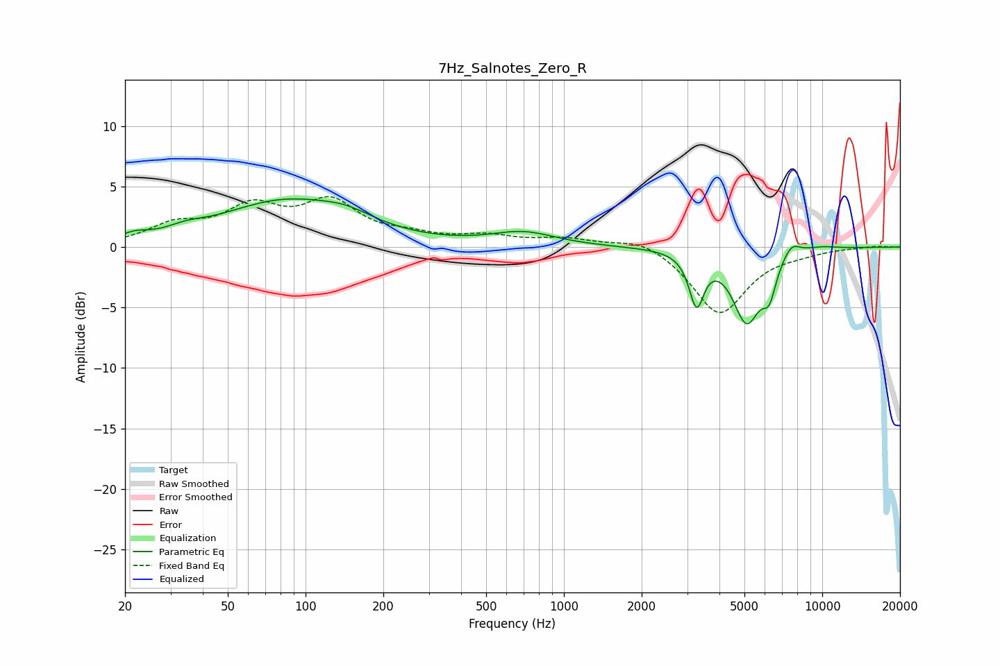

# 7Hz_Salnotes_Zero_R
See [usage instructions](https://github.com/jaakkopasanen/AutoEq#usage) for more options and info.

### Parametric EQs
Apply preamp of -4.1 dB when using parametric equalizer.

|   # | Type    |   Fc (Hz) |    Q |   Gain (dB) |
|-----|---------|-----------|------|-------------|
|   1 | Peaking |        22 | 2.85 |         0.5 |
|   2 | Peaking |        34 | 2.02 |         0.5 |
|   3 | Peaking |        84 | 0.56 |         3.7 |
|   4 | Peaking |       145 | 1.42 |         0.8 |
|   5 | Peaking |       696 | 1.14 |         1.1 |
|   6 | Peaking |      3261 | 5.02 |        -4.2 |
|   7 | Peaking |      5100 | 2.55 |        -5.9 |
|   8 | Peaking |      6236 | 5.16 |        -2.5 |
|   9 | Peaking |      7591 | 3.84 |         1.1 |
|  10 | Peaking |      9911 | 2.04 |         0.3 |

### Fixed Band EQs
When using fixed band (also called graphic) equalizer, apply preamp of **-4.3 dB** (if available) and set gains manually with these parameters.

|   # | Type    |   Fc (Hz) |    Q |   Gain (dB) |
|-----|---------|-----------|------|-------------|
|   1 | Peaking |        31 | 1.41 |         1.6 |
|   2 | Peaking |        62 | 1.41 |         2.9 |
|   3 | Peaking |       125 | 1.41 |         3.4 |
|   4 | Peaking |       250 | 1.41 |         0.7 |
|   5 | Peaking |       500 | 1.41 |         0.8 |
|   6 | Peaking |      1000 | 1.41 |         0.6 |
|   7 | Peaking |      2000 | 1.41 |         0.9 |
|   8 | Peaking |      4000 | 1.41 |        -5.5 |
|   9 | Peaking |      8000 | 1.41 |        -0.3 |
|  10 | Peaking |     16000 | 1.41 |         0.1 |

### Graphs

