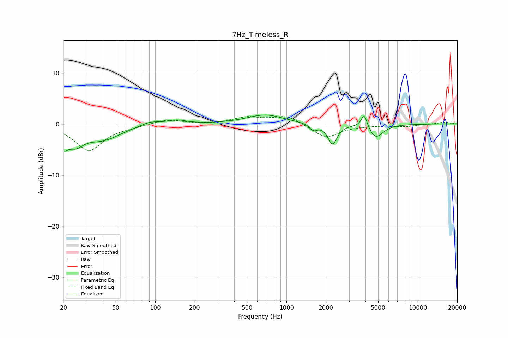

# 7Hz_Timeless_R
See [usage instructions](https://github.com/jaakkopasanen/AutoEq#usage) for more options and info.

### Parametric EQs
Apply preamp of -1.8 dB when using parametric equalizer.

|   # | Type    |   Fc (Hz) |    Q |   Gain (dB) |
|-----|---------|-----------|------|-------------|
|   1 | Peaking |        20 | 4.45 |        -2.9 |
|   2 | Peaking |        25 | 2.28 |        -2.9 |
|   3 | Peaking |        40 | 1.03 |        -2.9 |
|   4 | Peaking |        91 | 2.01 |         0.8 |
|   5 | Peaking |       145 | 1.96 |         0.8 |
|   6 | Peaking |       689 | 1.03 |         1.8 |
|   7 | Peaking |      1609 | 4.96 |        -1.2 |
|   8 | Peaking |      2245 | 4.06 |        -3.9 |
|   9 | Peaking |      3916 | 6    |         2.8 |
|  10 | Peaking |      4784 | 2.52 |        -2.7 |

### Fixed Band EQs
When using fixed band (also called graphic) equalizer, apply preamp of **-1.5 dB** (if available) and set gains manually with these parameters.

|   # | Type    |   Fc (Hz) |    Q |   Gain (dB) |
|-----|---------|-----------|------|-------------|
|   1 | Peaking |        31 | 1.41 |        -5.2 |
|   2 | Peaking |        62 | 1.41 |        -0.4 |
|   3 | Peaking |       125 | 1.41 |         0.9 |
|   4 | Peaking |       250 | 1.41 |        -0.1 |
|   5 | Peaking |       500 | 1.41 |         1.2 |
|   6 | Peaking |      1000 | 1.41 |         1.6 |
|   7 | Peaking |      2000 | 1.41 |        -2.7 |
|   8 | Peaking |      4000 | 1.41 |        -0.2 |
|   9 | Peaking |      8000 | 1.41 |        -0.5 |
|  10 | Peaking |     16000 | 1.41 |         0.4 |

### Graphs

