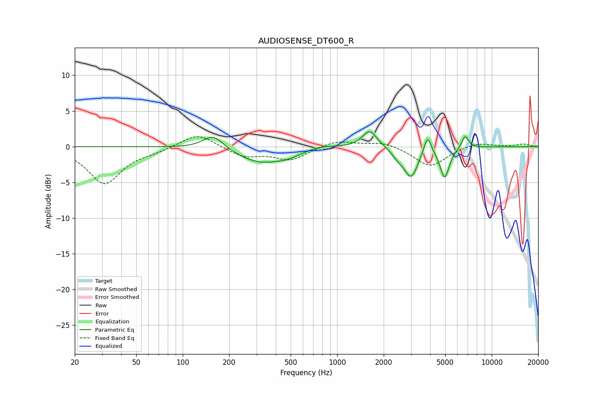

# AUDIOSENSE_DT600_R
See [usage instructions](https://github.com/jaakkopasanen/AutoEq#usage) for more options and info.

### Parametric EQs
Apply preamp of -2.2 dB when using parametric equalizer.

|   # | Type    |   Fc (Hz) |    Q |   Gain (dB) |
|-----|---------|-----------|------|-------------|
|   1 | Peaking |       158 | 2.14 |         2   |
|   2 | Peaking |       317 | 0.93 |        -2.2 |
|   3 | Peaking |       481 | 1.91 |        -0.6 |
|   4 | Peaking |       787 | 1.66 |         0.4 |
|   5 | Peaking |      1623 | 2.96 |         2.4 |
|   6 | Peaking |      2473 | 3.9  |        -0.9 |
|   7 | Peaking |      3007 | 3.13 |        -4.1 |
|   8 | Peaking |      3841 | 6    |         2.7 |
|   9 | Peaking |      4963 | 4.75 |        -4.3 |
|  10 | Peaking |      6732 | 6    |         1.8 |

### Fixed Band EQs
When using fixed band (also called graphic) equalizer, apply preamp of **-1.5 dB** (if available) and set gains manually with these parameters.

|   # | Type    |   Fc (Hz) |    Q |   Gain (dB) |
|-----|---------|-----------|------|-------------|
|   1 | Peaking |        31 | 1.41 |        -5.1 |
|   2 | Peaking |        62 | 1.41 |        -0.5 |
|   3 | Peaking |       125 | 1.41 |         2   |
|   4 | Peaking |       250 | 1.41 |        -1.4 |
|   5 | Peaking |       500 | 1.41 |        -1.8 |
|   6 | Peaking |      1000 | 1.41 |         0.9 |
|   7 | Peaking |      2000 | 1.41 |         0.7 |
|   8 | Peaking |      4000 | 1.41 |        -2.8 |
|   9 | Peaking |      8000 | 1.41 |         0.7 |
|  10 | Peaking |     16000 | 1.41 |         0.4 |

### Graphs

