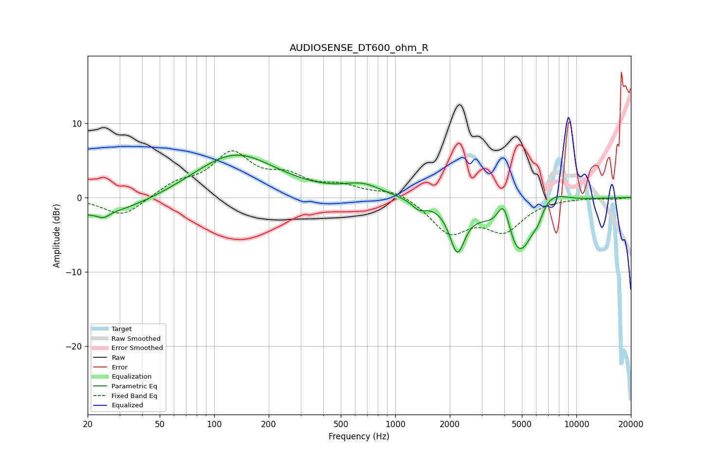

# AUDIOSENSE_DT600_ohm_R
See [usage instructions](https://github.com/jaakkopasanen/AutoEq#usage) for more options and info.

### Parametric EQs
Apply preamp of -5.8 dB when using parametric equalizer.

|   # | Type    |   Fc (Hz) |    Q |   Gain (dB) |
|-----|---------|-----------|------|-------------|
|   1 | Peaking |        22 | 0.5  |        -2.6 |
|   2 | Peaking |        24 | 4.69 |        -0.7 |
|   3 | Peaking |       130 | 0.62 |         6   |
|   4 | Peaking |       660 | 1.37 |         1.5 |
|   5 | Peaking |      1355 | 3.53 |        -1.2 |
|   6 | Peaking |      2198 | 3.38 |        -6.2 |
|   7 | Peaking |      3978 | 3.78 |         5.1 |
|   8 | Peaking |      4814 | 1.31 |        -9.8 |
|   9 | Peaking |      6161 | 5.34 |        -1.1 |
|  10 | Peaking |      6846 | 1.35 |         3.7 |

### Fixed Band EQs
When using fixed band (also called graphic) equalizer, apply preamp of **-6.4 dB** (if available) and set gains manually with these parameters.

|   # | Type    |   Fc (Hz) |    Q |   Gain (dB) |
|-----|---------|-----------|------|-------------|
|   1 | Peaking |        31 | 1.41 |        -2.6 |
|   2 | Peaking |        62 | 1.41 |         1.7 |
|   3 | Peaking |       125 | 1.41 |         5.6 |
|   4 | Peaking |       250 | 1.41 |         2.4 |
|   5 | Peaking |       500 | 1.41 |         1.3 |
|   6 | Peaking |      1000 | 1.41 |         1.1 |
|   7 | Peaking |      2000 | 1.41 |        -4.5 |
|   8 | Peaking |      4000 | 1.41 |        -4.1 |
|   9 | Peaking |      8000 | 1.41 |         0   |
|  10 | Peaking |     16000 | 1.41 |        -0.2 |

### Graphs

