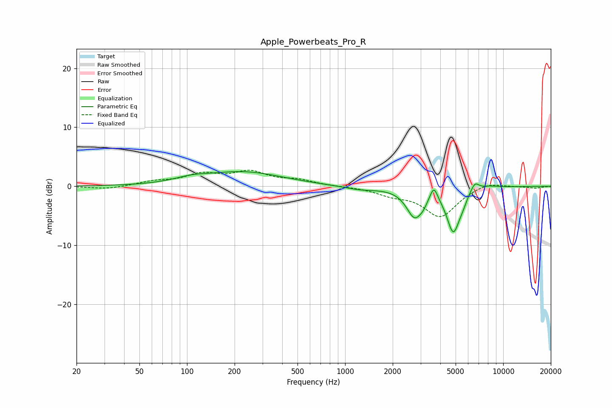

# Apple_Powerbeats_Pro_R
See [usage instructions](https://github.com/jaakkopasanen/AutoEq#usage) for more options and info.

### Parametric EQs
Apply preamp of -2.6 dB when using parametric equalizer.

|   # | Type    |   Fc (Hz) |    Q |   Gain (dB) |
|-----|---------|-----------|------|-------------|
|   1 | Peaking |       107 | 1.31 |         0.7 |
|   2 | Peaking |       229 | 0.57 |         2.4 |
|   3 | Peaking |      1244 | 1.34 |        -0.6 |
|   4 | Peaking |      2757 | 2.73 |        -4.8 |
|   5 | Peaking |      3122 | 6    |        -0.7 |
|   6 | Peaking |      3641 | 6    |         2.4 |
|   7 | Peaking |      4840 | 3.29 |        -7.4 |
|   8 | Peaking |      5542 | 6    |        -0.7 |
|   9 | Peaking |      6610 | 5.05 |         1.6 |
|  10 | Peaking |      8113 | 2.42 |         0.4 |

### Fixed Band EQs
When using fixed band (also called graphic) equalizer, apply preamp of **-2.8 dB** (if available) and set gains manually with these parameters.

|   # | Type    |   Fc (Hz) |    Q |   Gain (dB) |
|-----|---------|-----------|------|-------------|
|   1 | Peaking |        31 | 1.41 |        -0.5 |
|   2 | Peaking |        62 | 1.41 |         0.7 |
|   3 | Peaking |       125 | 1.41 |         1.8 |
|   4 | Peaking |       250 | 1.41 |         2.2 |
|   5 | Peaking |       500 | 1.41 |         0.9 |
|   6 | Peaking |      1000 | 1.41 |        -0   |
|   7 | Peaking |      2000 | 1.41 |        -1.2 |
|   8 | Peaking |      4000 | 1.41 |        -5.1 |
|   9 | Peaking |      8000 | 1.41 |         0.9 |
|  10 | Peaking |     16000 | 1.41 |        -0.3 |

### Graphs

