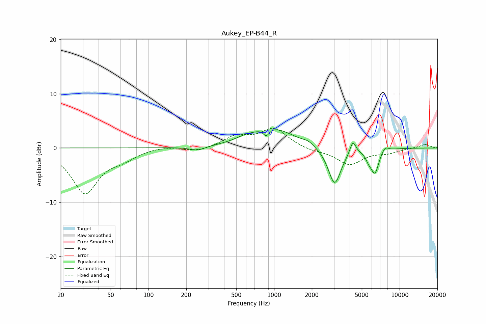

# Aukey_EP-B44_R
See [usage instructions](https://github.com/jaakkopasanen/AutoEq#usage) for more options and info.

### Parametric EQs
Apply preamp of -3.5 dB when using parametric equalizer.

|   # | Type    |   Fc (Hz) |    Q |   Gain (dB) |
|-----|---------|-----------|------|-------------|
|   1 | Peaking |       245 | 2.31 |        -0.8 |
|   2 | Peaking |       574 | 2.11 |         0.4 |
|   3 | Peaking |       868 | 6    |        -1.4 |
|   4 | Peaking |       951 | 0.82 |         3.8 |
|   5 | Peaking |      1875 | 3.42 |         0.6 |
|   6 | Peaking |      3037 | 2.74 |        -7   |
|   7 | Peaking |      4247 | 6    |         2.4 |
|   8 | Peaking |      5670 | 5.83 |        -1.1 |
|   9 | Peaking |      6352 | 4.25 |        -4.4 |
|  10 | Peaking |      7658 | 5.03 |         1   |

### Fixed Band EQs
When using fixed band (also called graphic) equalizer, apply preamp of **-3.7 dB** (if available) and set gains manually with these parameters.

|   # | Type    |   Fc (Hz) |    Q |   Gain (dB) |
|-----|---------|-----------|------|-------------|
|   1 | Peaking |        31 | 1.41 |        -8.2 |
|   2 | Peaking |        62 | 1.41 |        -1.4 |
|   3 | Peaking |       125 | 1.41 |         0.4 |
|   4 | Peaking |       250 | 1.41 |        -0.7 |
|   5 | Peaking |       500 | 1.41 |         2   |
|   6 | Peaking |      1000 | 1.41 |         3.5 |
|   7 | Peaking |      2000 | 1.41 |        -0.5 |
|   8 | Peaking |      4000 | 1.41 |        -3   |
|   9 | Peaking |      8000 | 1.41 |        -0.8 |
|  10 | Peaking |     16000 | 1.41 |         0.7 |

### Graphs

