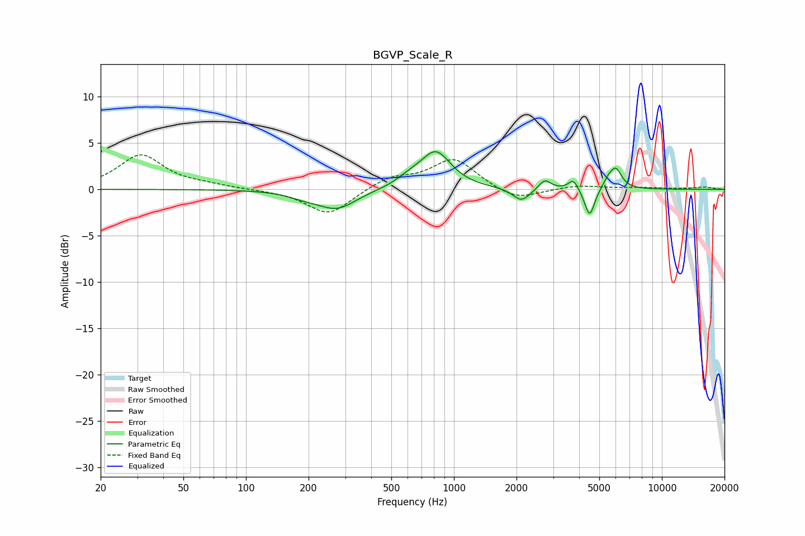

# BGVP_Scale_R
See [usage instructions](https://github.com/jaakkopasanen/AutoEq#usage) for more options and info.

### Parametric EQs
Apply preamp of -4.2 dB when using parametric equalizer.

|   # | Type    |   Fc (Hz) |    Q |   Gain (dB) |
|-----|---------|-----------|------|-------------|
|   1 | Peaking |       191 | 1.86 |        -0.5 |
|   2 | Peaking |       274 | 1.51 |        -2.1 |
|   3 | Peaking |       613 | 2.18 |         0.8 |
|   4 | Peaking |       819 | 1.96 |         3.9 |
|   5 | Peaking |      2113 | 3.46 |        -1.4 |
|   6 | Peaking |      2735 | 4.89 |         1.1 |
|   7 | Peaking |      3754 | 6    |         1.2 |
|   8 | Peaking |      4493 | 5.91 |        -3.1 |
|   9 | Peaking |      5502 | 6    |         0.7 |
|  10 | Peaking |      6004 | 4.86 |         2.1 |

### Fixed Band EQs
When using fixed band (also called graphic) equalizer, apply preamp of **-3.8 dB** (if available) and set gains manually with these parameters.

|   # | Type    |   Fc (Hz) |    Q |   Gain (dB) |
|-----|---------|-----------|------|-------------|
|   1 | Peaking |        31 | 1.41 |         3.7 |
|   2 | Peaking |        62 | 1.41 |         0.3 |
|   3 | Peaking |       125 | 1.41 |        -0   |
|   4 | Peaking |       250 | 1.41 |        -2.8 |
|   5 | Peaking |       500 | 1.41 |         1.3 |
|   6 | Peaking |      1000 | 1.41 |         3.3 |
|   7 | Peaking |      2000 | 1.41 |        -1.3 |
|   8 | Peaking |      4000 | 1.41 |         0.4 |
|   9 | Peaking |      8000 | 1.41 |         0.2 |
|  10 | Peaking |     16000 | 1.41 |         0.3 |

### Graphs

