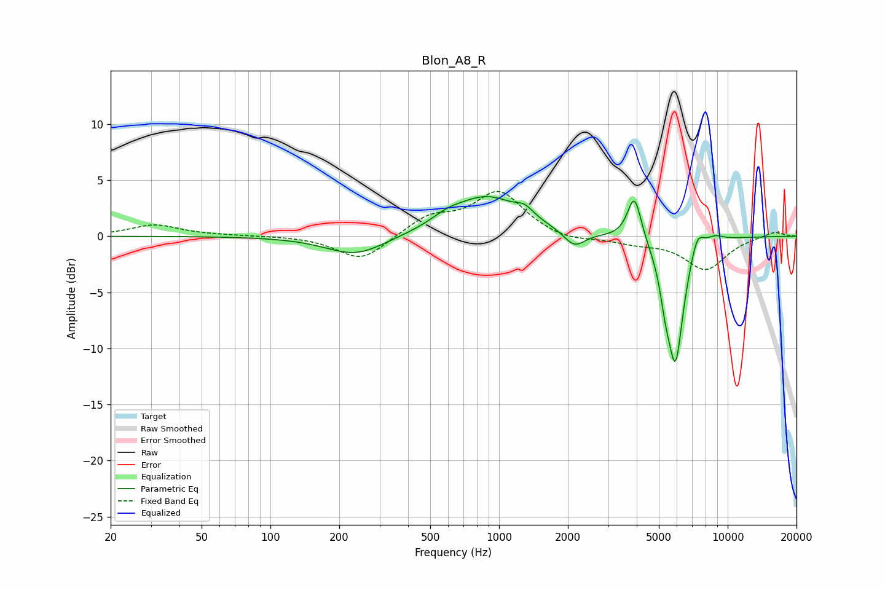

# Blon_A8_R
See [usage instructions](https://github.com/jaakkopasanen/AutoEq#usage) for more options and info.

### Parametric EQs
Apply preamp of -3.6 dB when using parametric equalizer.

|   # | Type    |   Fc (Hz) |    Q |   Gain (dB) |
|-----|---------|-----------|------|-------------|
|   1 | Peaking |       236 | 1.09 |        -1.8 |
|   2 | Peaking |       590 | 2.15 |         0.6 |
|   3 | Peaking |       883 | 0.94 |         3.5 |
|   4 | Peaking |      1297 | 3.79 |         0.8 |
|   5 | Peaking |      2135 | 2.99 |        -1.5 |
|   6 | Peaking |      3909 | 4.61 |         4.1 |
|   7 | Peaking |      5334 | 6    |        -2.2 |
|   8 | Peaking |      5908 | 3.77 |       -11   |
|   9 | Peaking |      7359 | 4.64 |         1.9 |
|  10 | Peaking |      8775 | 3.25 |         0.5 |

### Fixed Band EQs
When using fixed band (also called graphic) equalizer, apply preamp of **-4.1 dB** (if available) and set gains manually with these parameters.

|   # | Type    |   Fc (Hz) |    Q |   Gain (dB) |
|-----|---------|-----------|------|-------------|
|   1 | Peaking |        31 | 1.41 |         1   |
|   2 | Peaking |        62 | 1.41 |         0.1 |
|   3 | Peaking |       125 | 1.41 |         0   |
|   4 | Peaking |       250 | 1.41 |        -2.2 |
|   5 | Peaking |       500 | 1.41 |         1.7 |
|   6 | Peaking |      1000 | 1.41 |         3.9 |
|   7 | Peaking |      2000 | 1.41 |        -0.5 |
|   8 | Peaking |      4000 | 1.41 |        -0.5 |
|   9 | Peaking |      8000 | 1.41 |        -2.9 |
|  10 | Peaking |     16000 | 1.41 |         0.5 |

### Graphs

