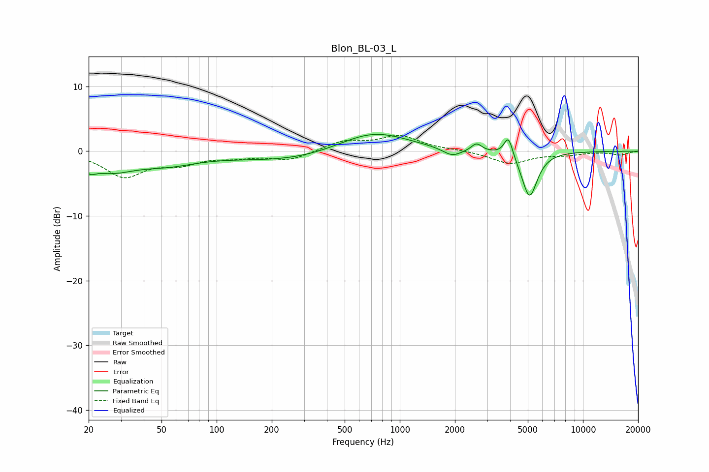

# Blon_BL-03_L
See [usage instructions](https://github.com/jaakkopasanen/AutoEq#usage) for more options and info.

### Parametric EQs
Apply preamp of -2.7 dB when using parametric equalizer.

|   # | Type    |   Fc (Hz) |    Q |   Gain (dB) |
|-----|---------|-----------|------|-------------|
|   1 | Peaking |        20 | 4.55 |        -1.2 |
|   2 | Peaking |        26 | 1.07 |        -2.6 |
|   3 | Peaking |        54 | 0.85 |        -1.6 |
|   4 | Peaking |       266 | 0.44 |        -1.6 |
|   5 | Peaking |       683 | 0.72 |         2.8 |
|   6 | Peaking |       791 | 0.84 |         0.7 |
|   7 | Peaking |      1932 | 2.75 |        -1.2 |
|   8 | Peaking |      2624 | 5    |         1.2 |
|   9 | Peaking |      3917 | 5.83 |         3.2 |
|  10 | Peaking |      5107 | 3.27 |        -7.1 |

### Fixed Band EQs
When using fixed band (also called graphic) equalizer, apply preamp of **-2.5 dB** (if available) and set gains manually with these parameters.

|   # | Type    |   Fc (Hz) |    Q |   Gain (dB) |
|-----|---------|-----------|------|-------------|
|   1 | Peaking |        31 | 1.41 |        -3.8 |
|   2 | Peaking |        62 | 1.41 |        -1.6 |
|   3 | Peaking |       125 | 1.41 |        -0.7 |
|   4 | Peaking |       250 | 1.41 |        -1.3 |
|   5 | Peaking |       500 | 1.41 |         1.5 |
|   6 | Peaking |      1000 | 1.41 |         2.2 |
|   7 | Peaking |      2000 | 1.41 |         0.2 |
|   8 | Peaking |      4000 | 1.41 |        -1.9 |
|   9 | Peaking |      8000 | 1.41 |        -0.5 |
|  10 | Peaking |     16000 | 1.41 |        -0.6 |

### Graphs

