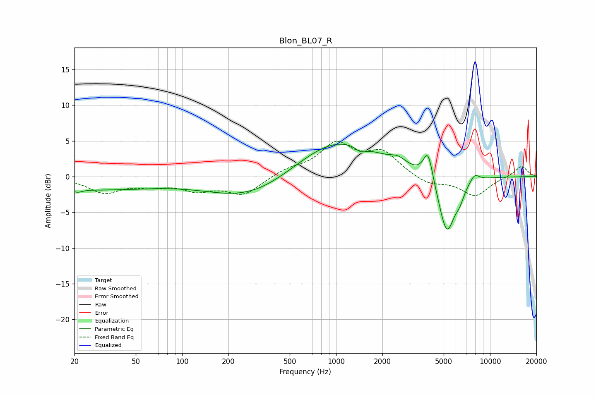

# Blon_BL07_R
See [usage instructions](https://github.com/jaakkopasanen/AutoEq#usage) for more options and info.

### Parametric EQs
Apply preamp of -4.6 dB when using parametric equalizer.

|   # | Type    |   Fc (Hz) |    Q |   Gain (dB) |
|-----|---------|-----------|------|-------------|
|   1 | Peaking |        21 | 4.63 |        -0.5 |
|   2 | Peaking |        28 | 0.36 |        -1.7 |
|   3 | Peaking |       282 | 0.51 |        -3.3 |
|   4 | Peaking |      1009 | 0.51 |         5.5 |
|   5 | Peaking |      1445 | 4    |        -0.8 |
|   6 | Peaking |      2527 | 2.87 |         0.9 |
|   7 | Peaking |      3960 | 4.51 |         4.2 |
|   8 | Peaking |      5240 | 2.5  |        -8.4 |
|   9 | Peaking |      6365 | 5.06 |        -1.3 |
|  10 | Peaking |      7931 | 4.17 |         1.1 |

### Fixed Band EQs
When using fixed band (also called graphic) equalizer, apply preamp of **-5.0 dB** (if available) and set gains manually with these parameters.

|   # | Type    |   Fc (Hz) |    Q |   Gain (dB) |
|-----|---------|-----------|------|-------------|
|   1 | Peaking |        31 | 1.41 |        -2.1 |
|   2 | Peaking |        62 | 1.41 |        -1   |
|   3 | Peaking |       125 | 1.41 |        -1.7 |
|   4 | Peaking |       250 | 1.41 |        -2.4 |
|   5 | Peaking |       500 | 1.41 |         0.9 |
|   6 | Peaking |      1000 | 1.41 |         4.3 |
|   7 | Peaking |      2000 | 1.41 |         3.2 |
|   8 | Peaking |      4000 | 1.41 |        -1.2 |
|   9 | Peaking |      8000 | 1.41 |        -2.7 |
|  10 | Peaking |     16000 | 1.41 |         1.5 |

### Graphs

