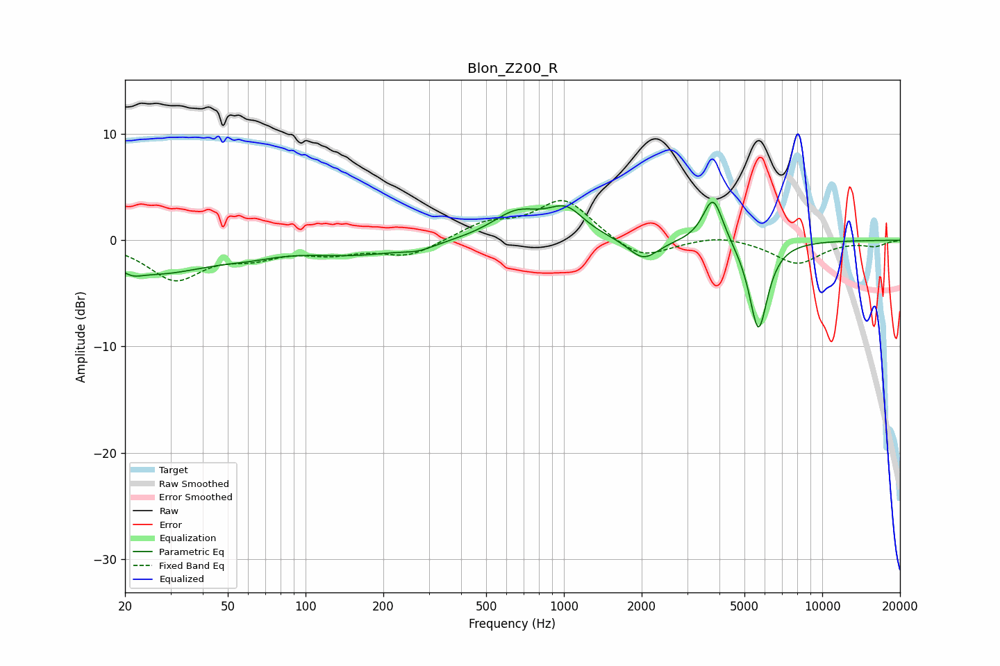

# Blon_Z200_R
See [usage instructions](https://github.com/jaakkopasanen/AutoEq#usage) for more options and info.

### Parametric EQs
Apply preamp of -3.7 dB when using parametric equalizer.

|   # | Type    |   Fc (Hz) |    Q |   Gain (dB) |
|-----|---------|-----------|------|-------------|
|   1 | Peaking |        22 | 4.3  |        -0.4 |
|   2 | Peaking |        26 | 0.62 |        -3   |
|   3 | Peaking |        61 | 1.37 |        -0.5 |
|   4 | Peaking |       158 | 0.74 |        -1.2 |
|   5 | Peaking |       274 | 2.2  |        -0.5 |
|   6 | Peaking |       657 | 1.43 |         2.5 |
|   7 | Peaking |      1020 | 2.02 |         2.5 |
|   8 | Peaking |      2031 | 2.43 |        -2   |
|   9 | Peaking |      3779 | 3.61 |         4.4 |
|  10 | Peaking |      5662 | 3.77 |        -8.6 |

### Fixed Band EQs
When using fixed band (also called graphic) equalizer, apply preamp of **-3.8 dB** (if available) and set gains manually with these parameters.

|   # | Type    |   Fc (Hz) |    Q |   Gain (dB) |
|-----|---------|-----------|------|-------------|
|   1 | Peaking |        31 | 1.41 |        -3.5 |
|   2 | Peaking |        62 | 1.41 |        -1.3 |
|   3 | Peaking |       125 | 1.41 |        -1   |
|   4 | Peaking |       250 | 1.41 |        -1.5 |
|   5 | Peaking |       500 | 1.41 |         1.5 |
|   6 | Peaking |      1000 | 1.41 |         3.8 |
|   7 | Peaking |      2000 | 1.41 |        -1.9 |
|   8 | Peaking |      4000 | 1.41 |         0.6 |
|   9 | Peaking |      8000 | 1.41 |        -2.2 |
|  10 | Peaking |     16000 | 1.41 |        -0.5 |

### Graphs

