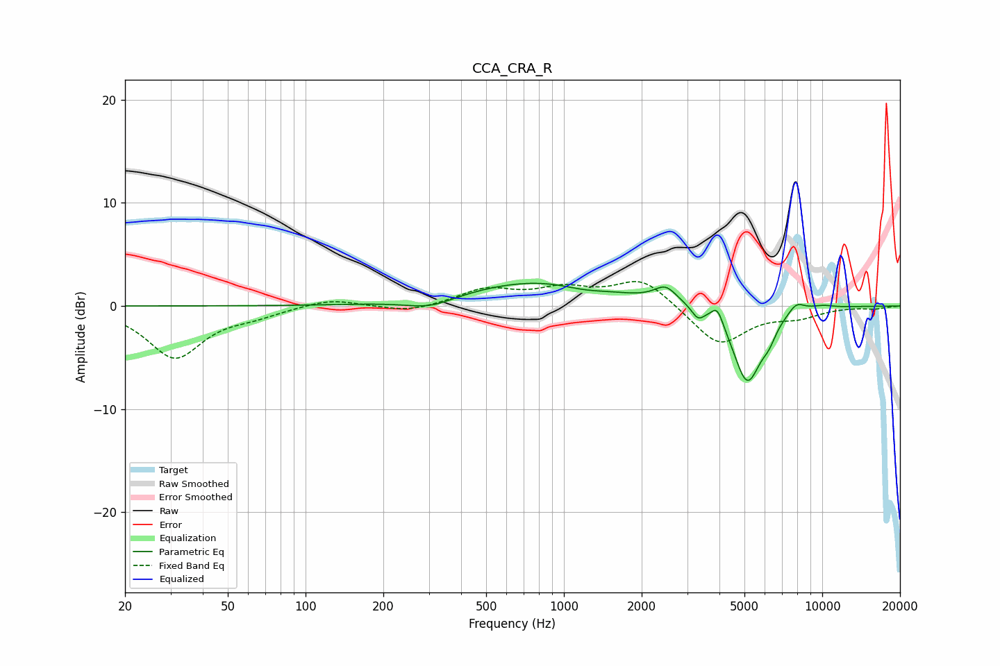

# CCA_CRA_R
See [usage instructions](https://github.com/jaakkopasanen/AutoEq#usage) for more options and info.

### Parametric EQs
Apply preamp of -2.3 dB when using parametric equalizer.

|   # | Type    |   Fc (Hz) |    Q |   Gain (dB) |
|-----|---------|-----------|------|-------------|
|   1 | Peaking |       303 | 1.48 |        -1   |
|   2 | Peaking |       808 | 0.5  |         2.4 |
|   3 | Peaking |      1191 | 1.63 |        -0.5 |
|   4 | Peaking |      2479 | 3.22 |         1.5 |
|   5 | Peaking |      3303 | 6    |        -1   |
|   6 | Peaking |      3926 | 6    |         1.7 |
|   7 | Peaking |      5127 | 2.47 |        -7.4 |
|   8 | Peaking |      6215 | 4.9  |        -1.2 |
|   9 | Peaking |      7941 | 3.92 |         1   |
|  10 | Peaking |     10000 | 2.83 |         0.3 |

### Fixed Band EQs
When using fixed band (also called graphic) equalizer, apply preamp of **-2.5 dB** (if available) and set gains manually with these parameters.

|   # | Type    |   Fc (Hz) |    Q |   Gain (dB) |
|-----|---------|-----------|------|-------------|
|   1 | Peaking |        31 | 1.41 |        -5   |
|   2 | Peaking |        62 | 1.41 |        -0.7 |
|   3 | Peaking |       125 | 1.41 |         0.8 |
|   4 | Peaking |       250 | 1.41 |        -0.7 |
|   5 | Peaking |       500 | 1.41 |         1.5 |
|   6 | Peaking |      1000 | 1.41 |         1.5 |
|   7 | Peaking |      2000 | 1.41 |         2.7 |
|   8 | Peaking |      4000 | 1.41 |        -3.8 |
|   9 | Peaking |      8000 | 1.41 |        -0.9 |
|  10 | Peaking |     16000 | 1.41 |        -0.2 |

### Graphs

