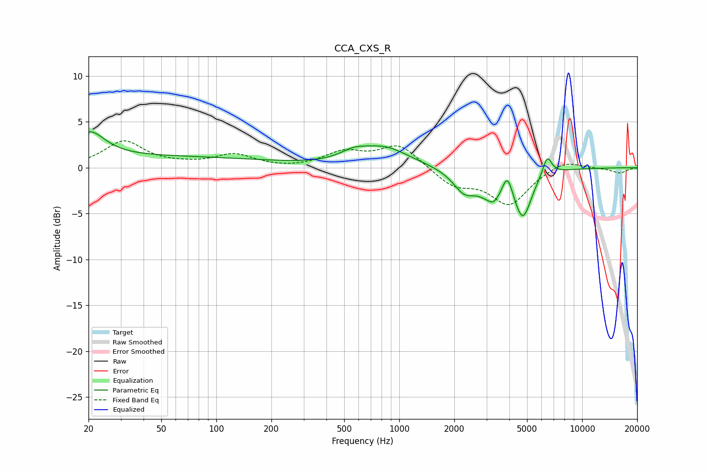

# CCA_CXS_R
See [usage instructions](https://github.com/jaakkopasanen/AutoEq#usage) for more options and info.

### Parametric EQs
Apply preamp of -4.0 dB when using parametric equalizer.

|   # | Type    |   Fc (Hz) |    Q |   Gain (dB) |
|-----|---------|-----------|------|-------------|
|   1 | Peaking |        20 | 1.7  |         2.8 |
|   2 | Peaking |        42 | 0.19 |         1.2 |
|   3 | Peaking |       564 | 1.85 |         0.9 |
|   4 | Peaking |       834 | 1.05 |         2.1 |
|   5 | Peaking |      2264 | 2.31 |        -2.2 |
|   6 | Peaking |      3229 | 1.86 |        -2.7 |
|   7 | Peaking |      3279 | 5.99 |        -0.4 |
|   8 | Peaking |      3900 | 5.06 |         2.5 |
|   9 | Peaking |      4737 | 2.98 |        -4.9 |
|  10 | Peaking |      6446 | 5.54 |         2.1 |

### Fixed Band EQs
When using fixed band (also called graphic) equalizer, apply preamp of **-3.0 dB** (if available) and set gains manually with these parameters.

|   # | Type    |   Fc (Hz) |    Q |   Gain (dB) |
|-----|---------|-----------|------|-------------|
|   1 | Peaking |        31 | 1.41 |         2.8 |
|   2 | Peaking |        62 | 1.41 |         0.2 |
|   3 | Peaking |       125 | 1.41 |         1.4 |
|   4 | Peaking |       250 | 1.41 |        -0.1 |
|   5 | Peaking |       500 | 1.41 |         1.6 |
|   6 | Peaking |      1000 | 1.41 |         2.5 |
|   7 | Peaking |      2000 | 1.41 |        -1.9 |
|   8 | Peaking |      4000 | 1.41 |        -3.9 |
|   9 | Peaking |      8000 | 1.41 |         1   |
|  10 | Peaking |     16000 | 1.41 |        -0.6 |

### Graphs

