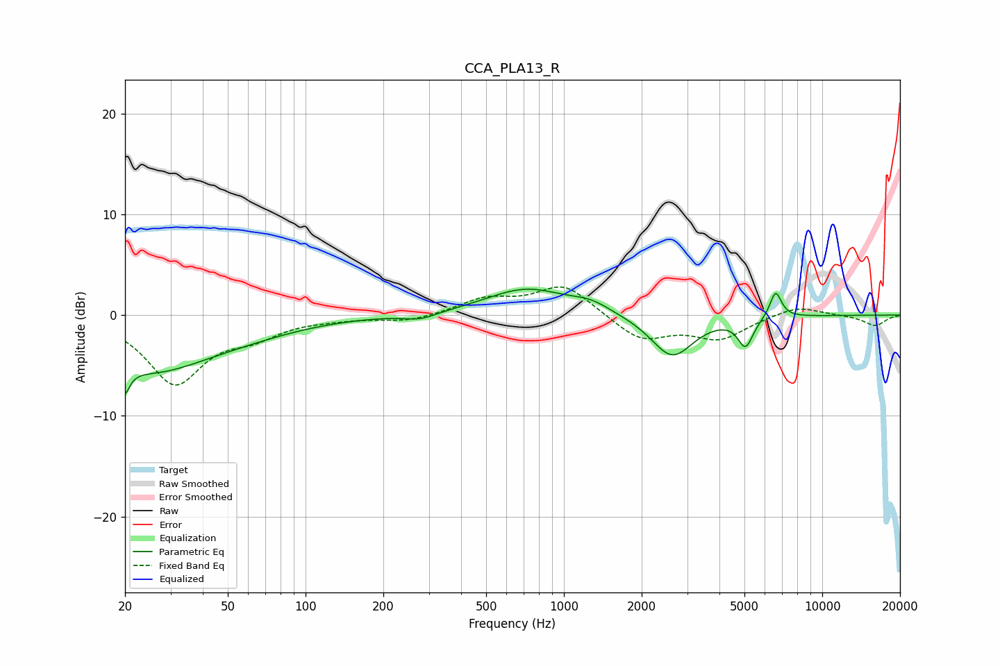

# CCA_PLA13_R
See [usage instructions](https://github.com/jaakkopasanen/AutoEq#usage) for more options and info.

### Parametric EQs
Apply preamp of -2.7 dB when using parametric equalizer.

|   # | Type    |   Fc (Hz) |    Q |   Gain (dB) |
|-----|---------|-----------|------|-------------|
|   1 | Peaking |        20 | 5.92 |        -6.2 |
|   2 | Peaking |        20 | 5.82 |         3.3 |
|   3 | Peaking |        25 | 0.65 |        -5   |
|   4 | Peaking |        56 | 0.62 |        -1.2 |
|   5 | Peaking |       279 | 2.18 |        -0.7 |
|   6 | Peaking |       717 | 0.9  |         2.6 |
|   7 | Peaking |      1272 | 1.9  |         0.9 |
|   8 | Peaking |      2625 | 1.72 |        -4.2 |
|   9 | Peaking |      5048 | 4.8  |        -2.8 |
|  10 | Peaking |      6600 | 5.99 |         2.7 |

### Fixed Band EQs
When using fixed band (also called graphic) equalizer, apply preamp of **-2.9 dB** (if available) and set gains manually with these parameters.

|   # | Type    |   Fc (Hz) |    Q |   Gain (dB) |
|-----|---------|-----------|------|-------------|
|   1 | Peaking |        31 | 1.41 |        -6.6 |
|   2 | Peaking |        62 | 1.41 |        -1.7 |
|   3 | Peaking |       125 | 1.41 |        -0.2 |
|   4 | Peaking |       250 | 1.41 |        -0.6 |
|   5 | Peaking |       500 | 1.41 |         1.5 |
|   6 | Peaking |      1000 | 1.41 |         3   |
|   7 | Peaking |      2000 | 1.41 |        -2.5 |
|   8 | Peaking |      4000 | 1.41 |        -2.2 |
|   9 | Peaking |      8000 | 1.41 |         1   |
|  10 | Peaking |     16000 | 1.41 |        -1.1 |

### Graphs

