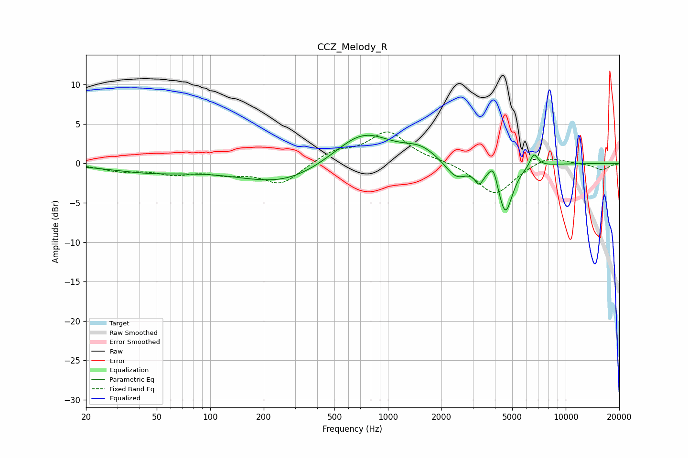

# CCZ_Melody_R
See [usage instructions](https://github.com/jaakkopasanen/AutoEq#usage) for more options and info.

### Parametric EQs
Apply preamp of -3.7 dB when using parametric equalizer.

|   # | Type    |   Fc (Hz) |    Q |   Gain (dB) |
|-----|---------|-----------|------|-------------|
|   1 | Peaking |        46 | 0.6  |        -1   |
|   2 | Peaking |       244 | 0.54 |        -2   |
|   3 | Peaking |       275 | 0.78 |        -0.6 |
|   4 | Peaking |       722 | 0.88 |         4.2 |
|   5 | Peaking |      1529 | 1.52 |         1.5 |
|   6 | Peaking |      2423 | 2.29 |        -2.2 |
|   7 | Peaking |      3257 | 5.97 |        -1.7 |
|   8 | Peaking |      3918 | 6    |         2   |
|   9 | Peaking |      4571 | 3.39 |        -6.3 |
|  10 | Peaking |      6623 | 5.95 |         1.8 |

### Fixed Band EQs
When using fixed band (also called graphic) equalizer, apply preamp of **-4.1 dB** (if available) and set gains manually with these parameters.

|   # | Type    |   Fc (Hz) |    Q |   Gain (dB) |
|-----|---------|-----------|------|-------------|
|   1 | Peaking |        31 | 1.41 |        -0.9 |
|   2 | Peaking |        62 | 1.41 |        -1.1 |
|   3 | Peaking |       125 | 1.41 |        -1.1 |
|   4 | Peaking |       250 | 1.41 |        -2.6 |
|   5 | Peaking |       500 | 1.41 |         1.5 |
|   6 | Peaking |      1000 | 1.41 |         3.9 |
|   7 | Peaking |      2000 | 1.41 |         0.3 |
|   8 | Peaking |      4000 | 1.41 |        -4   |
|   9 | Peaking |      8000 | 1.41 |         1.1 |
|  10 | Peaking |     16000 | 1.41 |        -0.8 |

### Graphs

