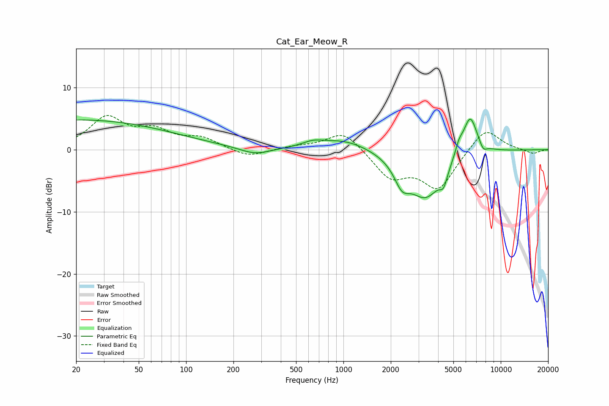

# Cat_Ear_Meow_R
See [usage instructions](https://github.com/jaakkopasanen/AutoEq#usage) for more options and info.

### Parametric EQs
Apply preamp of -5.0 dB when using parametric equalizer.

|   # | Type    |   Fc (Hz) |    Q |   Gain (dB) |
|-----|---------|-----------|------|-------------|
|   1 | Peaking |        20 | 0.22 |         4.8 |
|   2 | Peaking |       274 | 1.42 |        -1.2 |
|   3 | Peaking |       637 | 2.15 |         0.7 |
|   4 | Peaking |      1014 | 0.87 |         1.8 |
|   5 | Peaking |      2356 | 2.94 |        -3.2 |
|   6 | Peaking |      3337 | 1.24 |        -7.6 |
|   7 | Peaking |      4327 | 5.9  |        -2.1 |
|   8 | Peaking |      5424 | 5.58 |         1.6 |
|   9 | Peaking |      6384 | 2.92 |         6.5 |
|  10 | Peaking |      7736 | 5.88 |        -1.2 |

### Fixed Band EQs
When using fixed band (also called graphic) equalizer, apply preamp of **-5.6 dB** (if available) and set gains manually with these parameters.

|   # | Type    |   Fc (Hz) |    Q |   Gain (dB) |
|-----|---------|-----------|------|-------------|
|   1 | Peaking |        31 | 1.41 |         5   |
|   2 | Peaking |        62 | 1.41 |         2.6 |
|   3 | Peaking |       125 | 1.41 |         1.7 |
|   4 | Peaking |       250 | 1.41 |        -1.3 |
|   5 | Peaking |       500 | 1.41 |         0.5 |
|   6 | Peaking |      1000 | 1.41 |         3.1 |
|   7 | Peaking |      2000 | 1.41 |        -4.3 |
|   8 | Peaking |      4000 | 1.41 |        -6.1 |
|   9 | Peaking |      8000 | 1.41 |         3.8 |
|  10 | Peaking |     16000 | 1.41 |        -0.7 |

### Graphs

