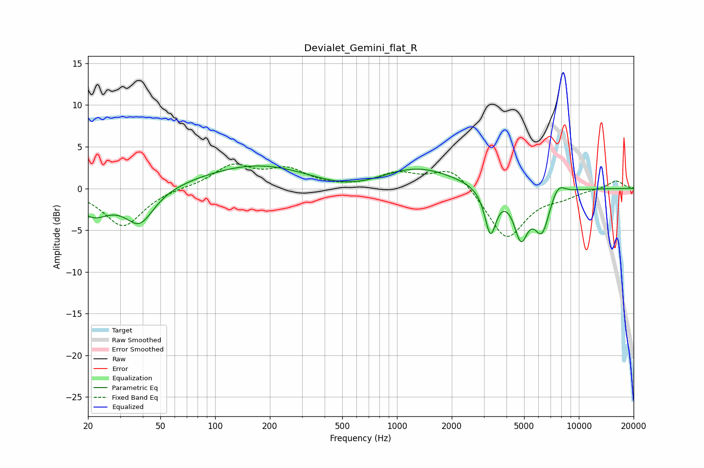

# Devialet_Gemini_flat_R
See [usage instructions](https://github.com/jaakkopasanen/AutoEq#usage) for more options and info.

### Parametric EQs
Apply preamp of -2.8 dB when using parametric equalizer.

|   # | Type    |   Fc (Hz) |    Q |   Gain (dB) |
|-----|---------|-----------|------|-------------|
|   1 | Peaking |        21 | 1.49 |        -3   |
|   2 | Peaking |        39 | 1.76 |        -4.7 |
|   3 | Peaking |        39 | 1.61 |         0.6 |
|   4 | Peaking |       181 | 0.45 |         3   |
|   5 | Peaking |       537 | 0.63 |        -1.4 |
|   6 | Peaking |      1261 | 0.68 |         2.7 |
|   7 | Peaking |      3267 | 4.56 |        -5.5 |
|   8 | Peaking |      4806 | 3.65 |        -5.4 |
|   9 | Peaking |      6266 | 3.12 |        -4.9 |
|  10 | Peaking |      7659 | 3.39 |         1.6 |

### Fixed Band EQs
When using fixed band (also called graphic) equalizer, apply preamp of **-3.0 dB** (if available) and set gains manually with these parameters.

|   # | Type    |   Fc (Hz) |    Q |   Gain (dB) |
|-----|---------|-----------|------|-------------|
|   1 | Peaking |        31 | 1.41 |        -4.6 |
|   2 | Peaking |        62 | 1.41 |         0.1 |
|   3 | Peaking |       125 | 1.41 |         2.7 |
|   4 | Peaking |       250 | 1.41 |         2.1 |
|   5 | Peaking |       500 | 1.41 |        -0   |
|   6 | Peaking |      1000 | 1.41 |         1.7 |
|   7 | Peaking |      2000 | 1.41 |         2.7 |
|   8 | Peaking |      4000 | 1.41 |        -6.2 |
|   9 | Peaking |      8000 | 1.41 |        -0.8 |
|  10 | Peaking |     16000 | 1.41 |         1   |

### Graphs

