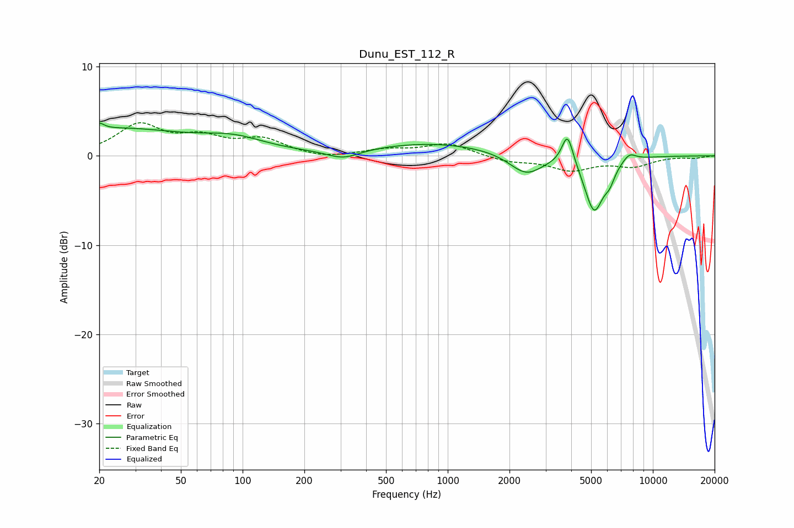

# Dunu_EST_112_R
See [usage instructions](https://github.com/jaakkopasanen/AutoEq#usage) for more options and info.

### Parametric EQs
Apply preamp of -3.7 dB when using parametric equalizer.

|   # | Type    |   Fc (Hz) |    Q |   Gain (dB) |
|-----|---------|-----------|------|-------------|
|   1 | Peaking |        20 | 6    |         0.7 |
|   2 | Peaking |        24 | 0.42 |         2.9 |
|   3 | Peaking |        90 | 0.9  |         1.4 |
|   4 | Peaking |       309 | 1.76 |        -1   |
|   5 | Peaking |       854 | 0.46 |         1.4 |
|   6 | Peaking |      2408 | 1.73 |        -2.3 |
|   7 | Peaking |      3838 | 5.09 |         3.5 |
|   8 | Peaking |      5172 | 3    |        -6.1 |
|   9 | Peaking |      6155 | 5.34 |        -1.4 |
|  10 | Peaking |      7685 | 4.16 |         0.9 |

### Fixed Band EQs
When using fixed band (also called graphic) equalizer, apply preamp of **-3.8 dB** (if available) and set gains manually with these parameters.

|   # | Type    |   Fc (Hz) |    Q |   Gain (dB) |
|-----|---------|-----------|------|-------------|
|   1 | Peaking |        31 | 1.41 |         3.3 |
|   2 | Peaking |        62 | 1.41 |         1.8 |
|   3 | Peaking |       125 | 1.41 |         1.7 |
|   4 | Peaking |       250 | 1.41 |        -0.4 |
|   5 | Peaking |       500 | 1.41 |         0.6 |
|   6 | Peaking |      1000 | 1.41 |         1.4 |
|   7 | Peaking |      2000 | 1.41 |        -0.6 |
|   8 | Peaking |      4000 | 1.41 |        -1.5 |
|   9 | Peaking |      8000 | 1.41 |        -1.1 |
|  10 | Peaking |     16000 | 1.41 |        -0.2 |

### Graphs

