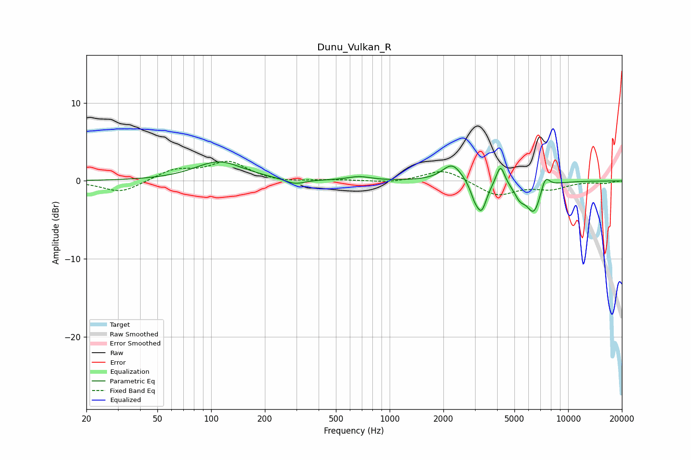

# Dunu_Vulkan_R
See [usage instructions](https://github.com/jaakkopasanen/AutoEq#usage) for more options and info.

### Parametric EQs
Apply preamp of -2.5 dB when using parametric equalizer.

|   # | Type    |   Fc (Hz) |    Q |   Gain (dB) |
|-----|---------|-----------|------|-------------|
|   1 | Peaking |       111 | 1.05 |         2.5 |
|   2 | Peaking |       294 | 2.56 |        -0.7 |
|   3 | Peaking |       674 | 2.25 |         0.5 |
|   4 | Peaking |      2240 | 2.6  |         2.3 |
|   5 | Peaking |      2981 | 6    |        -1.3 |
|   6 | Peaking |      3267 | 4.71 |        -3.7 |
|   7 | Peaking |      4175 | 6    |         2.6 |
|   8 | Peaking |      5365 | 4.48 |        -1.5 |
|   9 | Peaking |      6423 | 3.27 |        -4   |
|  10 | Peaking |      7440 | 5.36 |         1.9 |

### Fixed Band EQs
When using fixed band (also called graphic) equalizer, apply preamp of **-2.6 dB** (if available) and set gains manually with these parameters.

|   # | Type    |   Fc (Hz) |    Q |   Gain (dB) |
|-----|---------|-----------|------|-------------|
|   1 | Peaking |        31 | 1.41 |        -1.6 |
|   2 | Peaking |        62 | 1.41 |         1.4 |
|   3 | Peaking |       125 | 1.41 |         2.4 |
|   4 | Peaking |       250 | 1.41 |        -0.3 |
|   5 | Peaking |       500 | 1.41 |         0.1 |
|   6 | Peaking |      1000 | 1.41 |        -0.3 |
|   7 | Peaking |      2000 | 1.41 |         1.6 |
|   8 | Peaking |      4000 | 1.41 |        -1.9 |
|   9 | Peaking |      8000 | 1.41 |        -0.9 |
|  10 | Peaking |     16000 | 1.41 |        -0.3 |

### Graphs

