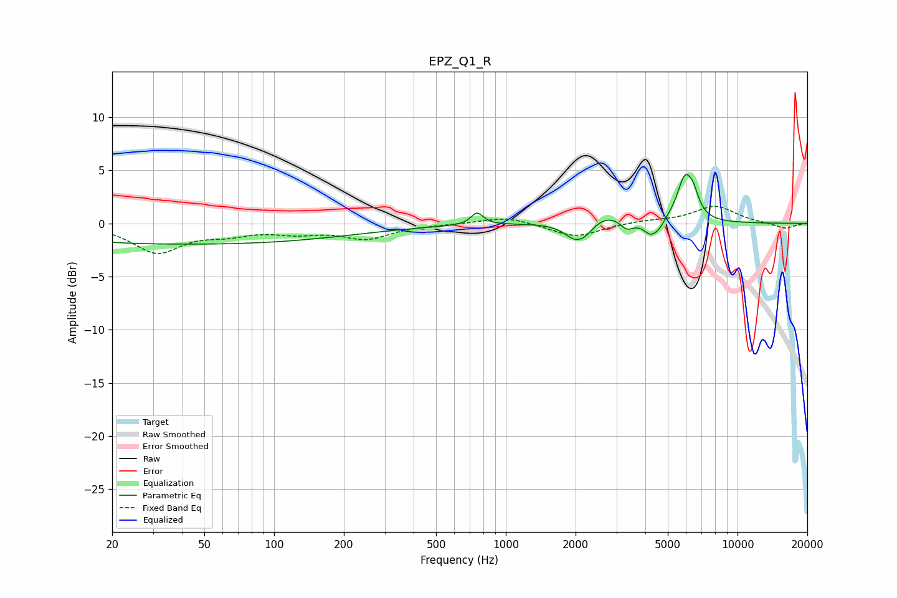

# EPZ_Q1_R
See [usage instructions](https://github.com/jaakkopasanen/AutoEq#usage) for more options and info.

### Parametric EQs
Apply preamp of -4.7 dB when using parametric equalizer.

|   # | Type    |   Fc (Hz) |    Q |   Gain (dB) |
|-----|---------|-----------|------|-------------|
|   1 | Peaking |        43 | 0.18 |        -2   |
|   2 | Peaking |       751 | 5.45 |         1.1 |
|   3 | Peaking |      1999 | 2.88 |        -1.6 |
|   4 | Peaking |      2216 | 3.9  |        -0.7 |
|   5 | Peaking |      2771 | 1.55 |         1.1 |
|   6 | Peaking |      3327 | 4.53 |        -1   |
|   7 | Peaking |      4216 | 4.41 |        -1.3 |
|   8 | Peaking |      4589 | 6    |        -0.6 |
|   9 | Peaking |      5936 | 3.99 |         4.1 |
|  10 | Peaking |      6473 | 6    |         1.3 |

### Fixed Band EQs
When using fixed band (also called graphic) equalizer, apply preamp of **-1.7 dB** (if available) and set gains manually with these parameters.

|   # | Type    |   Fc (Hz) |    Q |   Gain (dB) |
|-----|---------|-----------|------|-------------|
|   1 | Peaking |        31 | 1.41 |        -2.6 |
|   2 | Peaking |        62 | 1.41 |        -0.8 |
|   3 | Peaking |       125 | 1.41 |        -0.7 |
|   4 | Peaking |       250 | 1.41 |        -1.3 |
|   5 | Peaking |       500 | 1.41 |        -0   |
|   6 | Peaking |      1000 | 1.41 |         0.7 |
|   7 | Peaking |      2000 | 1.41 |        -1.3 |
|   8 | Peaking |      4000 | 1.41 |         0.2 |
|   9 | Peaking |      8000 | 1.41 |         1.6 |
|  10 | Peaking |     16000 | 1.41 |        -0.5 |

### Graphs

