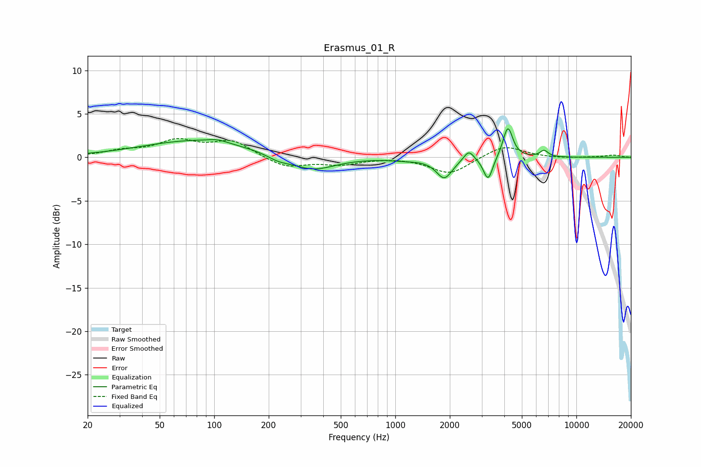

# Erasmus_01_R
See [usage instructions](https://github.com/jaakkopasanen/AutoEq#usage) for more options and info.

### Parametric EQs
Apply preamp of -3.4 dB when using parametric equalizer.

|   # | Type    |   Fc (Hz) |    Q |   Gain (dB) |
|-----|---------|-----------|------|-------------|
|   1 | Peaking |        81 | 0.47 |         2   |
|   2 | Peaking |       105 | 2.77 |         0.3 |
|   3 | Peaking |       226 | 2.36 |        -0.5 |
|   4 | Peaking |       349 | 1.14 |        -1.6 |
|   5 | Peaking |      1149 | 1.55 |        -0.2 |
|   6 | Peaking |      1866 | 3.18 |        -2.3 |
|   7 | Peaking |      2545 | 5.14 |         1.2 |
|   8 | Peaking |      3254 | 5.58 |        -2.7 |
|   9 | Peaking |      4184 | 5.36 |         3.6 |
|  10 | Peaking |      6632 | 6    |         0.7 |

### Fixed Band EQs
When using fixed band (also called graphic) equalizer, apply preamp of **-2.3 dB** (if available) and set gains manually with these parameters.

|   # | Type    |   Fc (Hz) |    Q |   Gain (dB) |
|-----|---------|-----------|------|-------------|
|   1 | Peaking |        31 | 1.41 |         0.6 |
|   2 | Peaking |        62 | 1.41 |         1.8 |
|   3 | Peaking |       125 | 1.41 |         1.8 |
|   4 | Peaking |       250 | 1.41 |        -1.2 |
|   5 | Peaking |       500 | 1.41 |        -0.7 |
|   6 | Peaking |      1000 | 1.41 |         0.1 |
|   7 | Peaking |      2000 | 1.41 |        -1.9 |
|   8 | Peaking |      4000 | 1.41 |         1.4 |
|   9 | Peaking |      8000 | 1.41 |        -0.1 |
|  10 | Peaking |     16000 | 1.41 |         0.2 |

### Graphs

