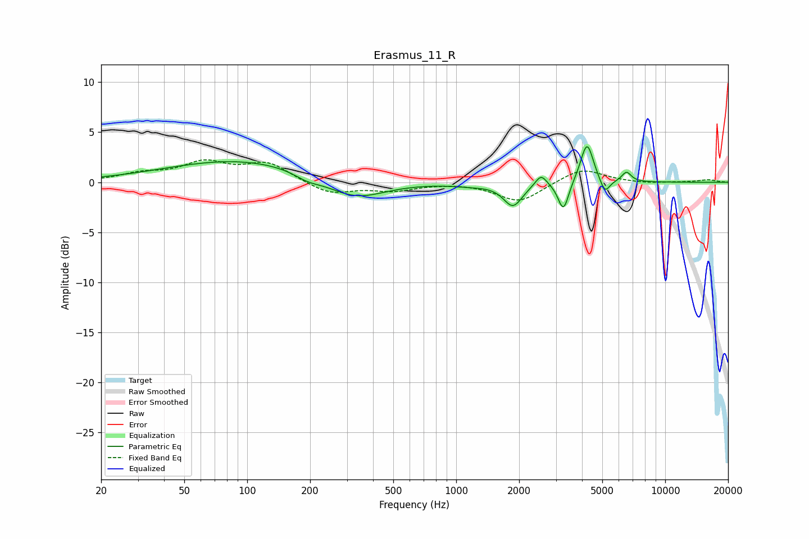

# Erasmus_11_R
See [usage instructions](https://github.com/jaakkopasanen/AutoEq#usage) for more options and info.

### Parametric EQs
Apply preamp of -3.7 dB when using parametric equalizer.

|   # | Type    |   Fc (Hz) |    Q |   Gain (dB) |
|-----|---------|-----------|------|-------------|
|   1 | Peaking |        95 | 0.39 |         2.3 |
|   2 | Peaking |       194 | 2.29 |        -0.6 |
|   3 | Peaking |       326 | 0.98 |        -2.1 |
|   4 | Peaking |      1166 | 1.61 |        -0.2 |
|   5 | Peaking |      1868 | 3.13 |        -2.3 |
|   6 | Peaking |      2546 | 5.23 |         1.2 |
|   7 | Peaking |      3259 | 5.61 |        -3   |
|   8 | Peaking |      4226 | 4.62 |         4.1 |
|   9 | Peaking |      5147 | 5.95 |        -1.5 |
|  10 | Peaking |      6529 | 6    |         1   |

### Fixed Band EQs
When using fixed band (also called graphic) equalizer, apply preamp of **-2.3 dB** (if available) and set gains manually with these parameters.

|   # | Type    |   Fc (Hz) |    Q |   Gain (dB) |
|-----|---------|-----------|------|-------------|
|   1 | Peaking |        31 | 1.41 |         0.8 |
|   2 | Peaking |        62 | 1.41 |         1.8 |
|   3 | Peaking |       125 | 1.41 |         1.8 |
|   4 | Peaking |       250 | 1.41 |        -1.2 |
|   5 | Peaking |       500 | 1.41 |        -0.7 |
|   6 | Peaking |      1000 | 1.41 |         0   |
|   7 | Peaking |      2000 | 1.41 |        -2   |
|   8 | Peaking |      4000 | 1.41 |         1.5 |
|   9 | Peaking |      8000 | 1.41 |        -0.1 |
|  10 | Peaking |     16000 | 1.41 |         0.3 |

### Graphs

