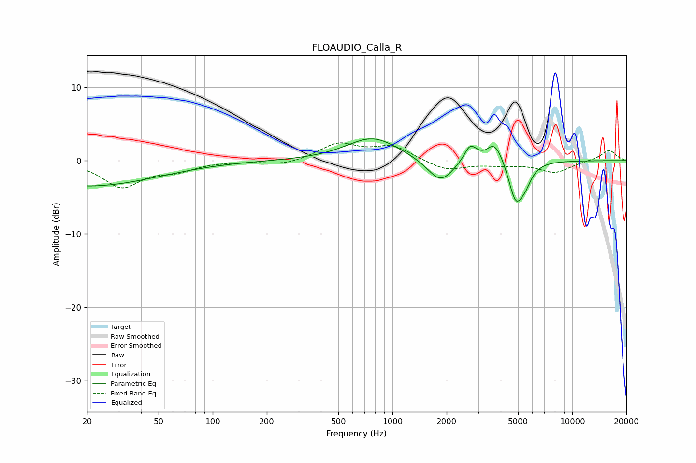

# FLOAUDIO_Calla_R
See [usage instructions](https://github.com/jaakkopasanen/AutoEq#usage) for more options and info.

### Parametric EQs
Apply preamp of -3.1 dB when using parametric equalizer.

|   # | Type    |   Fc (Hz) |    Q |   Gain (dB) |
|-----|---------|-----------|------|-------------|
|   1 | Peaking |        20 | 0.36 |        -3.5 |
|   2 | Peaking |       777 | 0.97 |         3.2 |
|   3 | Peaking |      1852 | 1.94 |        -3.3 |
|   4 | Peaking |      2696 | 4.52 |         1.8 |
|   5 | Peaking |      2881 | 2.63 |         0.4 |
|   6 | Peaking |      3290 | 3.75 |        -0.8 |
|   7 | Peaking |      3607 | 1.54 |         0.3 |
|   8 | Peaking |      3669 | 2.59 |         3.2 |
|   9 | Peaking |      4854 | 3.35 |        -5.7 |
|  10 | Peaking |      5504 | 4    |        -1.7 |

### Fixed Band EQs
When using fixed band (also called graphic) equalizer, apply preamp of **-2.5 dB** (if available) and set gains manually with these parameters.

|   # | Type    |   Fc (Hz) |    Q |   Gain (dB) |
|-----|---------|-----------|------|-------------|
|   1 | Peaking |        31 | 1.41 |        -3.5 |
|   2 | Peaking |        62 | 1.41 |        -1.2 |
|   3 | Peaking |       125 | 1.41 |        -0   |
|   4 | Peaking |       250 | 1.41 |        -0.6 |
|   5 | Peaking |       500 | 1.41 |         2.2 |
|   6 | Peaking |      1000 | 1.41 |         1.9 |
|   7 | Peaking |      2000 | 1.41 |        -1.4 |
|   8 | Peaking |      4000 | 1.41 |        -0.4 |
|   9 | Peaking |      8000 | 1.41 |        -1.6 |
|  10 | Peaking |     16000 | 1.41 |         1.5 |

### Graphs

