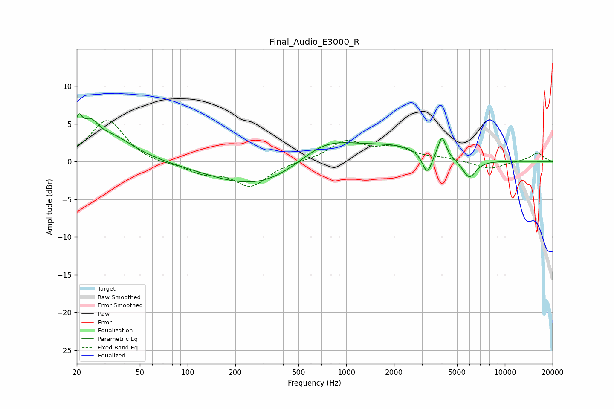

# Final_Audio_E3000_R
See [usage instructions](https://github.com/jaakkopasanen/AutoEq#usage) for more options and info.

### Parametric EQs
Apply preamp of -6.4 dB when using parametric equalizer.

|   # | Type    |   Fc (Hz) |    Q |   Gain (dB) |
|-----|---------|-----------|------|-------------|
|   1 | Peaking |        20 | 5.86 |         3.3 |
|   2 | Peaking |        24 | 2.93 |         2.8 |
|   3 | Peaking |        33 | 0.95 |         3.2 |
|   4 | Peaking |       309 | 0.45 |        -4   |
|   5 | Peaking |       707 | 0.98 |         1.3 |
|   6 | Peaking |       780 | 0.52 |         2.9 |
|   7 | Peaking |      2188 | 0.82 |         1.3 |
|   8 | Peaking |      3237 | 4.75 |        -2.8 |
|   9 | Peaking |      4012 | 5.45 |         2.9 |
|  10 | Peaking |      5967 | 3.2  |        -2.4 |

### Fixed Band EQs
When using fixed band (also called graphic) equalizer, apply preamp of **-5.5 dB** (if available) and set gains manually with these parameters.

|   # | Type    |   Fc (Hz) |    Q |   Gain (dB) |
|-----|---------|-----------|------|-------------|
|   1 | Peaking |        31 | 1.41 |         5.6 |
|   2 | Peaking |        62 | 1.41 |        -0.4 |
|   3 | Peaking |       125 | 1.41 |        -1.4 |
|   4 | Peaking |       250 | 1.41 |        -3.2 |
|   5 | Peaking |       500 | 1.41 |        -0   |
|   6 | Peaking |      1000 | 1.41 |         2.6 |
|   7 | Peaking |      2000 | 1.41 |         1.7 |
|   8 | Peaking |      4000 | 1.41 |         0.4 |
|   9 | Peaking |      8000 | 1.41 |        -1   |
|  10 | Peaking |     16000 | 1.41 |         1.1 |

### Graphs

