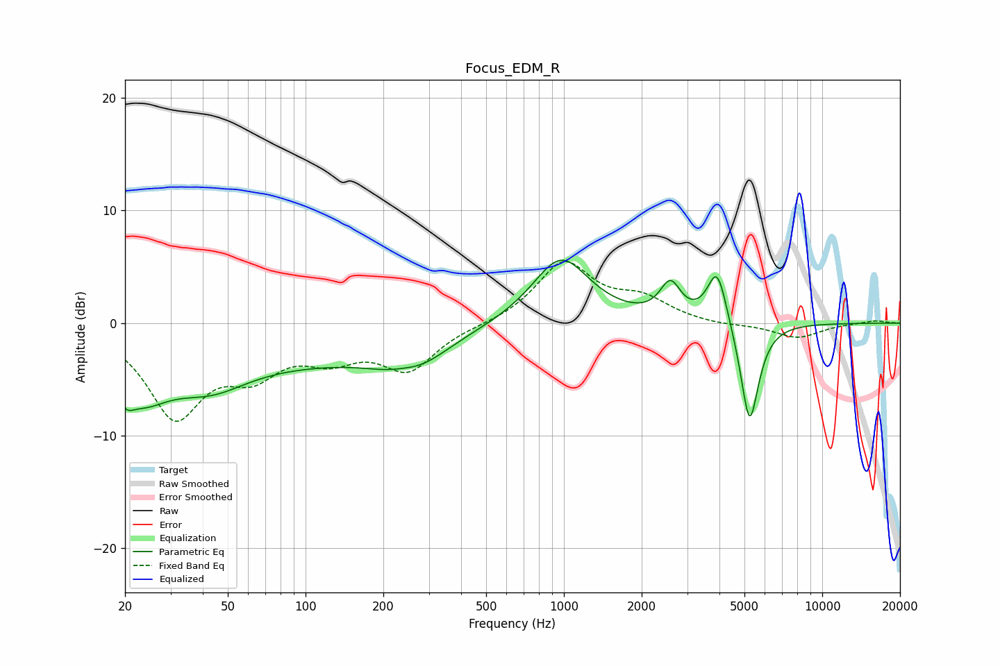

# Focus_EDM_R
See [usage instructions](https://github.com/jaakkopasanen/AutoEq#usage) for more options and info.

### Parametric EQs
Apply preamp of -5.7 dB when using parametric equalizer.

|   # | Type    |   Fc (Hz) |    Q |   Gain (dB) |
|-----|---------|-----------|------|-------------|
|   1 | Peaking |        20 | 4.88 |        -1.6 |
|   2 | Peaking |        23 | 1.26 |        -4.8 |
|   3 | Peaking |        42 | 0.91 |        -3.3 |
|   4 | Peaking |       101 | 0.38 |        -2.7 |
|   5 | Peaking |       243 | 1.92 |         0.9 |
|   6 | Peaking |       253 | 1.11 |        -3.2 |
|   7 | Peaking |       974 | 1.28 |         5.9 |
|   8 | Peaking |      2583 | 3.58 |         3   |
|   9 | Peaking |      3922 | 3.7  |         5   |
|  10 | Peaking |      5235 | 3.9  |        -9.3 |

### Fixed Band EQs
When using fixed band (also called graphic) equalizer, apply preamp of **-5.6 dB** (if available) and set gains manually with these parameters.

|   # | Type    |   Fc (Hz) |    Q |   Gain (dB) |
|-----|---------|-----------|------|-------------|
|   1 | Peaking |        31 | 1.41 |        -7.9 |
|   2 | Peaking |        62 | 1.41 |        -3.5 |
|   3 | Peaking |       125 | 1.41 |        -2.4 |
|   4 | Peaking |       250 | 1.41 |        -3.9 |
|   5 | Peaking |       500 | 1.41 |        -0.1 |
|   6 | Peaking |      1000 | 1.41 |         5.3 |
|   7 | Peaking |      2000 | 1.41 |         1.9 |
|   8 | Peaking |      4000 | 1.41 |        -0.2 |
|   9 | Peaking |      8000 | 1.41 |        -1.3 |
|  10 | Peaking |     16000 | 1.41 |         0.3 |

### Graphs

