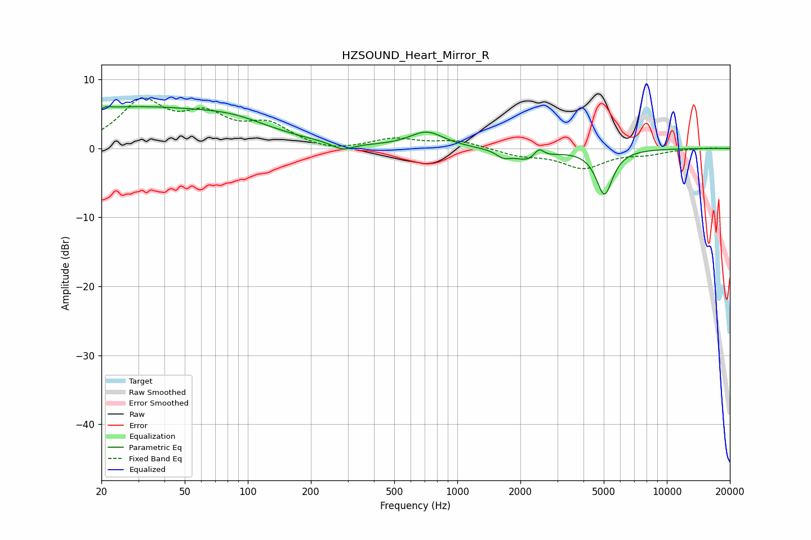

# HZSOUND_Heart_Mirror_R
See [usage instructions](https://github.com/jaakkopasanen/AutoEq#usage) for more options and info.

### Parametric EQs
Apply preamp of -6.2 dB when using parametric equalizer.

|   # | Type    |   Fc (Hz) |    Q |   Gain (dB) |
|-----|---------|-----------|------|-------------|
|   1 | Peaking |        20 | 5.92 |        -3.3 |
|   2 | Peaking |        20 | 5.92 |         3.2 |
|   3 | Peaking |        26 | 0.27 |         5.8 |
|   4 | Peaking |        86 | 0.87 |         1.3 |
|   5 | Peaking |       283 | 2.87 |        -1.1 |
|   6 | Peaking |       715 | 1.71 |         2.3 |
|   7 | Peaking |      1660 | 4.38 |        -0.9 |
|   8 | Peaking |      2223 | 1.98 |        -1.8 |
|   9 | Peaking |      2450 | 5.99 |         1.5 |
|  10 | Peaking |      5036 | 3.58 |        -6.6 |

### Fixed Band EQs
When using fixed band (also called graphic) equalizer, apply preamp of **-7.4 dB** (if available) and set gains manually with these parameters.

|   # | Type    |   Fc (Hz) |    Q |   Gain (dB) |
|-----|---------|-----------|------|-------------|
|   1 | Peaking |        31 | 1.41 |         6.4 |
|   2 | Peaking |        62 | 1.41 |         4   |
|   3 | Peaking |       125 | 1.41 |         3.1 |
|   4 | Peaking |       250 | 1.41 |        -0.7 |
|   5 | Peaking |       500 | 1.41 |         1.3 |
|   6 | Peaking |      1000 | 1.41 |         1.1 |
|   7 | Peaking |      2000 | 1.41 |        -0.9 |
|   8 | Peaking |      4000 | 1.41 |        -2.7 |
|   9 | Peaking |      8000 | 1.41 |        -0.7 |
|  10 | Peaking |     16000 | 1.41 |         0.1 |

### Graphs

