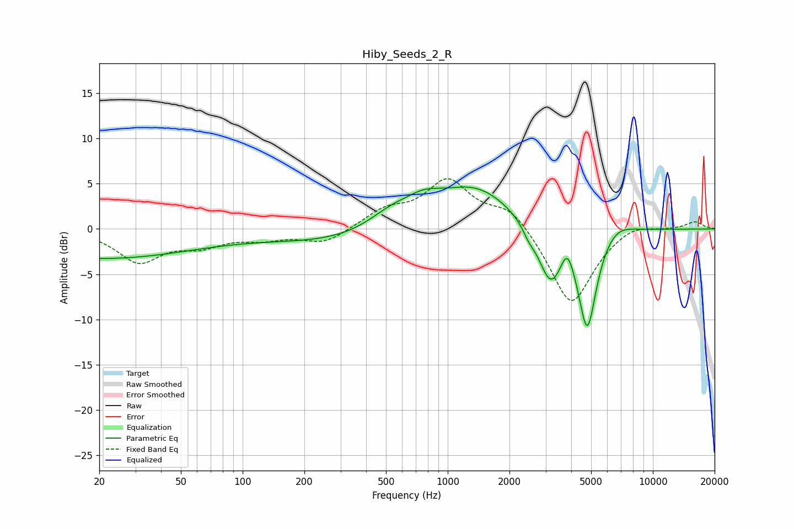

# Hiby_Seeds_2_R
See [usage instructions](https://github.com/jaakkopasanen/AutoEq#usage) for more options and info.

### Parametric EQs
Apply preamp of -4.7 dB when using parametric equalizer.

|   # | Type    |   Fc (Hz) |    Q |   Gain (dB) |
|-----|---------|-----------|------|-------------|
|   1 | Peaking |        20 | 0.29 |        -3.2 |
|   2 | Peaking |       388 | 0.33 |        -1.8 |
|   3 | Peaking |       536 | 1.13 |         2.2 |
|   4 | Peaking |       769 | 1.59 |         1.6 |
|   5 | Peaking |      1345 | 0.72 |         5.1 |
|   6 | Peaking |      2482 | 5.19 |        -0.8 |
|   7 | Peaking |      3174 | 2.23 |        -6.3 |
|   8 | Peaking |      3829 | 4.28 |         2.7 |
|   9 | Peaking |      4792 | 3    |       -11.2 |
|  10 | Peaking |      6546 | 1.69 |         1.4 |

### Fixed Band EQs
When using fixed band (also called graphic) equalizer, apply preamp of **-5.6 dB** (if available) and set gains manually with these parameters.

|   # | Type    |   Fc (Hz) |    Q |   Gain (dB) |
|-----|---------|-----------|------|-------------|
|   1 | Peaking |        31 | 1.41 |        -3.5 |
|   2 | Peaking |        62 | 1.41 |        -1.6 |
|   3 | Peaking |       125 | 1.41 |        -0.9 |
|   4 | Peaking |       250 | 1.41 |        -1.6 |
|   5 | Peaking |       500 | 1.41 |         1.9 |
|   6 | Peaking |      1000 | 1.41 |         5.1 |
|   7 | Peaking |      2000 | 1.41 |         2.5 |
|   8 | Peaking |      4000 | 1.41 |        -8.6 |
|   9 | Peaking |      8000 | 1.41 |         0.9 |
|  10 | Peaking |     16000 | 1.41 |         0.8 |

### Graphs

