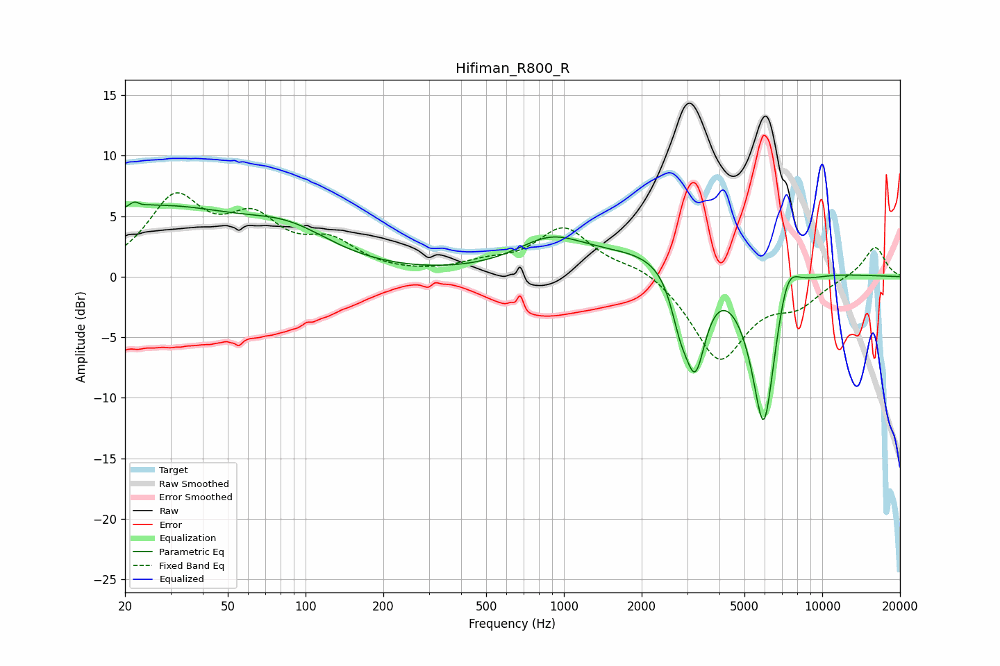

# Hifiman_R800_R
See [usage instructions](https://github.com/jaakkopasanen/AutoEq#usage) for more options and info.

### Parametric EQs
Apply preamp of -6.3 dB when using parametric equalizer.

|   # | Type    |   Fc (Hz) |    Q |   Gain (dB) |
|-----|---------|-----------|------|-------------|
|   1 | Peaking |        22 | 5.68 |         3.3 |
|   2 | Peaking |        23 | 6    |        -2.8 |
|   3 | Peaking |        26 | 0.4  |         5.5 |
|   4 | Peaking |        87 | 0.83 |         2.3 |
|   5 | Peaking |       886 | 1.06 |         2.4 |
|   6 | Peaking |      2810 | 3.98 |        -3   |
|   7 | Peaking |      3225 | 3.25 |        -8.2 |
|   8 | Peaking |      3402 | 0.4  |         2.9 |
|   9 | Peaking |      5942 | 2.51 |       -15   |
|  10 | Peaking |      7287 | 2.89 |         3.8 |

### Fixed Band EQs
When using fixed band (also called graphic) equalizer, apply preamp of **-7.0 dB** (if available) and set gains manually with these parameters.

|   # | Type    |   Fc (Hz) |    Q |   Gain (dB) |
|-----|---------|-----------|------|-------------|
|   1 | Peaking |        31 | 1.41 |         6.1 |
|   2 | Peaking |        62 | 1.41 |         4   |
|   3 | Peaking |       125 | 1.41 |         2.4 |
|   4 | Peaking |       250 | 1.41 |         0   |
|   5 | Peaking |       500 | 1.41 |         0.8 |
|   6 | Peaking |      1000 | 1.41 |         3.9 |
|   7 | Peaking |      2000 | 1.41 |         1   |
|   8 | Peaking |      4000 | 1.41 |        -6.9 |
|   9 | Peaking |      8000 | 1.41 |        -1.9 |
|  10 | Peaking |     16000 | 1.41 |         2.6 |

### Graphs

