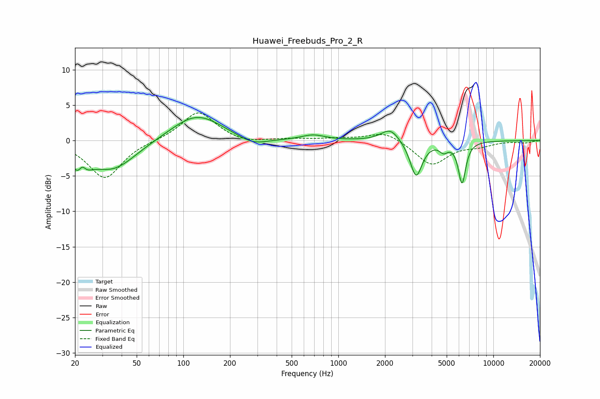

# Huawei_Freebuds_Pro_2_R
See [usage instructions](https://github.com/jaakkopasanen/AutoEq#usage) for more options and info.

### Parametric EQs
Apply preamp of -3.4 dB when using parametric equalizer.

|   # | Type    |   Fc (Hz) |    Q |   Gain (dB) |
|-----|---------|-----------|------|-------------|
|   1 | Peaking |        22 | 2.97 |        -4   |
|   2 | Peaking |        22 | 5.87 |         2.2 |
|   3 | Peaking |        35 | 0.94 |        -4.1 |
|   4 | Peaking |       122 | 0.86 |         3.8 |
|   5 | Peaking |       280 | 1.44 |        -1.2 |
|   6 | Peaking |       688 | 1.91 |         0.7 |
|   7 | Peaking |      2163 | 2.41 |         1.8 |
|   8 | Peaking |      3176 | 3.64 |        -5.2 |
|   9 | Peaking |      4780 | 5.29 |        -1.1 |
|  10 | Peaking |      6283 | 5.77 |        -5.9 |

### Fixed Band EQs
When using fixed band (also called graphic) equalizer, apply preamp of **-4.0 dB** (if available) and set gains manually with these parameters.

|   # | Type    |   Fc (Hz) |    Q |   Gain (dB) |
|-----|---------|-----------|------|-------------|
|   1 | Peaking |        31 | 1.41 |        -5.4 |
|   2 | Peaking |        62 | 1.41 |         0   |
|   3 | Peaking |       125 | 1.41 |         4.2 |
|   4 | Peaking |       250 | 1.41 |        -0.5 |
|   5 | Peaking |       500 | 1.41 |         0.2 |
|   6 | Peaking |      1000 | 1.41 |         0.2 |
|   7 | Peaking |      2000 | 1.41 |         1.4 |
|   8 | Peaking |      4000 | 1.41 |        -3.5 |
|   9 | Peaking |      8000 | 1.41 |        -0.6 |
|  10 | Peaking |     16000 | 1.41 |        -0.3 |

### Graphs

