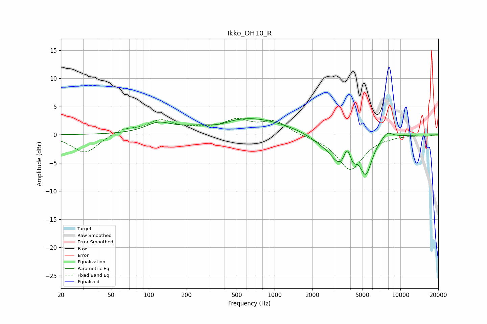

# Ikko_OH10_R
See [usage instructions](https://github.com/jaakkopasanen/AutoEq#usage) for more options and info.

### Parametric EQs
Apply preamp of -3.0 dB when using parametric equalizer.

|   # | Type    |   Fc (Hz) |    Q |   Gain (dB) |
|-----|---------|-----------|------|-------------|
|   1 | Peaking |       119 | 1.43 |         1.6 |
|   2 | Peaking |       359 | 1.52 |        -0.9 |
|   3 | Peaking |       583 | 0.42 |         3.2 |
|   4 | Peaking |      2383 | 1.25 |        -1.2 |
|   5 | Peaking |      3334 | 1.87 |        -4.9 |
|   6 | Peaking |      3773 | 5.42 |         2.6 |
|   7 | Peaking |      4228 | 4.3  |        -2.2 |
|   8 | Peaking |      4779 | 1.44 |         2.2 |
|   9 | Peaking |      5290 | 2.52 |        -7.8 |
|  10 | Peaking |      7858 | 3.17 |         1.2 |

### Fixed Band EQs
When using fixed band (also called graphic) equalizer, apply preamp of **-3.0 dB** (if available) and set gains manually with these parameters.

|   # | Type    |   Fc (Hz) |    Q |   Gain (dB) |
|-----|---------|-----------|------|-------------|
|   1 | Peaking |        31 | 1.41 |        -3.3 |
|   2 | Peaking |        62 | 1.41 |         1.1 |
|   3 | Peaking |       125 | 1.41 |         2.4 |
|   4 | Peaking |       250 | 1.41 |         0.8 |
|   5 | Peaking |       500 | 1.41 |         2.3 |
|   6 | Peaking |      1000 | 1.41 |         2.3 |
|   7 | Peaking |      2000 | 1.41 |        -0.3 |
|   8 | Peaking |      4000 | 1.41 |        -6.2 |
|   9 | Peaking |      8000 | 1.41 |        -0.1 |
|  10 | Peaking |     16000 | 1.41 |        -0.2 |

### Graphs

