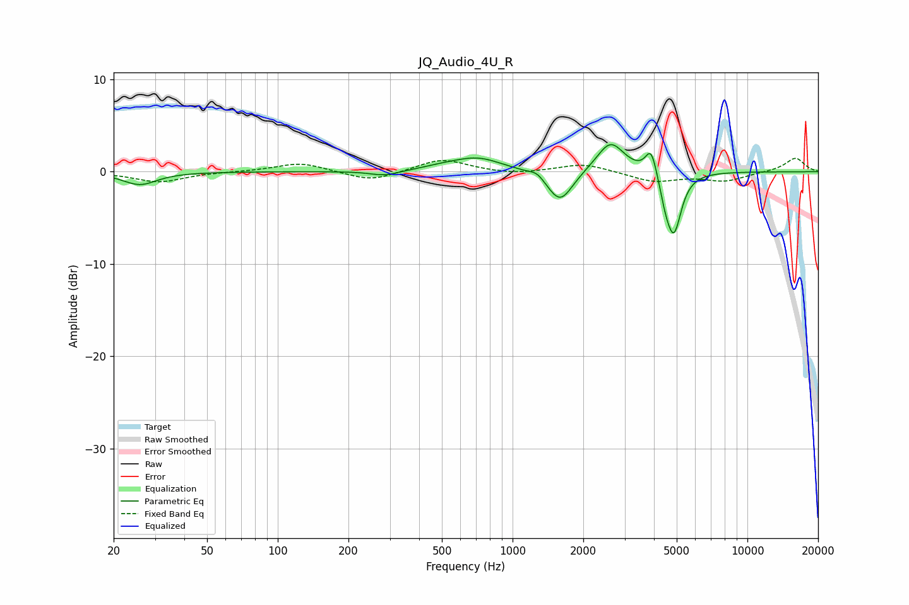

# JQ_Audio_4U_R
See [usage instructions](https://github.com/jaakkopasanen/AutoEq#usage) for more options and info.

### Parametric EQs
Apply preamp of -3.0 dB when using parametric equalizer.

|   # | Type    |   Fc (Hz) |    Q |   Gain (dB) |
|-----|---------|-----------|------|-------------|
|   1 | Peaking |        26 | 1.97 |        -1.4 |
|   2 | Peaking |       285 | 2.36 |        -0.5 |
|   3 | Peaking |       497 | 1.9  |         0.3 |
|   4 | Peaking |       706 | 1.33 |         1.5 |
|   5 | Peaking |      1271 | 4.87 |         0.6 |
|   6 | Peaking |      1593 | 2.61 |        -3.5 |
|   7 | Peaking |      2613 | 2.42 |         3.4 |
|   8 | Peaking |      3894 | 5.81 |         2.9 |
|   9 | Peaking |      4478 | 6    |        -1.7 |
|  10 | Peaking |      4865 | 4.42 |        -6.4 |

### Fixed Band EQs
When using fixed band (also called graphic) equalizer, apply preamp of **-1.5 dB** (if available) and set gains manually with these parameters.

|   # | Type    |   Fc (Hz) |    Q |   Gain (dB) |
|-----|---------|-----------|------|-------------|
|   1 | Peaking |        31 | 1.41 |        -1.1 |
|   2 | Peaking |        62 | 1.41 |         0   |
|   3 | Peaking |       125 | 1.41 |         1   |
|   4 | Peaking |       250 | 1.41 |        -1.1 |
|   5 | Peaking |       500 | 1.41 |         1.4 |
|   6 | Peaking |      1000 | 1.41 |        -0.3 |
|   7 | Peaking |      2000 | 1.41 |         0.9 |
|   8 | Peaking |      4000 | 1.41 |        -1.1 |
|   9 | Peaking |      8000 | 1.41 |        -1   |
|  10 | Peaking |     16000 | 1.41 |         1.5 |

### Graphs

