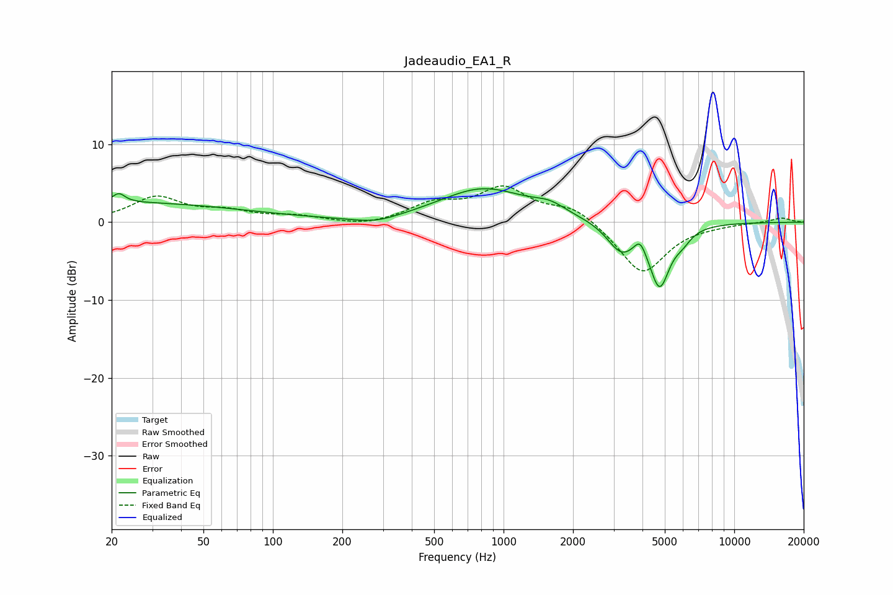

# Jadeaudio_EA1_R
See [usage instructions](https://github.com/jaakkopasanen/AutoEq#usage) for more options and info.

### Parametric EQs
Apply preamp of -4.4 dB when using parametric equalizer.

|   # | Type    |   Fc (Hz) |    Q |   Gain (dB) |
|-----|---------|-----------|------|-------------|
|   1 | Peaking |        20 | 0.23 |         2.5 |
|   2 | Peaking |        22 | 5.54 |         1.1 |
|   3 | Peaking |       279 | 1.38 |        -0.9 |
|   4 | Peaking |       818 | 0.75 |         4.3 |
|   5 | Peaking |      1583 | 1.98 |         1.1 |
|   6 | Peaking |      3181 | 2.35 |        -3   |
|   7 | Peaking |      3388 | 3.27 |        -0.6 |
|   8 | Peaking |      3910 | 5.93 |         1.6 |
|   9 | Peaking |      4746 | 3.07 |        -7.9 |
|  10 | Peaking |      5983 | 3.72 |        -1.1 |

### Fixed Band EQs
When using fixed band (also called graphic) equalizer, apply preamp of **-4.8 dB** (if available) and set gains manually with these parameters.

|   # | Type    |   Fc (Hz) |    Q |   Gain (dB) |
|-----|---------|-----------|------|-------------|
|   1 | Peaking |        31 | 1.41 |         3.1 |
|   2 | Peaking |        62 | 1.41 |         1.2 |
|   3 | Peaking |       125 | 1.41 |         0.7 |
|   4 | Peaking |       250 | 1.41 |        -0.6 |
|   5 | Peaking |       500 | 1.41 |         2.2 |
|   6 | Peaking |      1000 | 1.41 |         4.1 |
|   7 | Peaking |      2000 | 1.41 |         2   |
|   8 | Peaking |      4000 | 1.41 |        -6.7 |
|   9 | Peaking |      8000 | 1.41 |        -0.2 |
|  10 | Peaking |     16000 | 1.41 |         0.6 |

### Graphs

