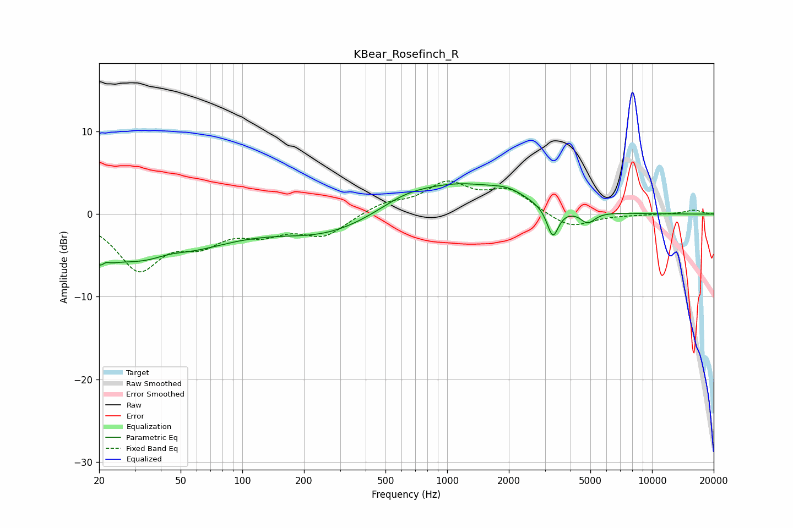

# KBear_Rosefinch_R
See [usage instructions](https://github.com/jaakkopasanen/AutoEq#usage) for more options and info.

### Parametric EQs
Apply preamp of -3.8 dB when using parametric equalizer.

|   # | Type    |   Fc (Hz) |    Q |   Gain (dB) |
|-----|---------|-----------|------|-------------|
|   1 | Peaking |        21 | 4.64 |        -4.3 |
|   2 | Peaking |        21 | 5.76 |         3.3 |
|   3 | Peaking |        33 | 0.43 |        -5.9 |
|   4 | Peaking |        44 | 1.59 |         0.8 |
|   5 | Peaking |       257 | 0.6  |        -2.4 |
|   6 | Peaking |       618 | 1.07 |         1.3 |
|   7 | Peaking |      1139 | 0.62 |         3.3 |
|   8 | Peaking |      1997 | 1.58 |         1.1 |
|   9 | Peaking |      3279 | 5    |        -3.7 |
|  10 | Peaking |      4857 | 4.04 |        -1.4 |

### Fixed Band EQs
When using fixed band (also called graphic) equalizer, apply preamp of **-4.1 dB** (if available) and set gains manually with these parameters.

|   # | Type    |   Fc (Hz) |    Q |   Gain (dB) |
|-----|---------|-----------|------|-------------|
|   1 | Peaking |        31 | 1.41 |        -6.4 |
|   2 | Peaking |        62 | 1.41 |        -2.8 |
|   3 | Peaking |       125 | 1.41 |        -1.9 |
|   4 | Peaking |       250 | 1.41 |        -2.5 |
|   5 | Peaking |       500 | 1.41 |         1.2 |
|   6 | Peaking |      1000 | 1.41 |         3.5 |
|   7 | Peaking |      2000 | 1.41 |         2.7 |
|   8 | Peaking |      4000 | 1.41 |        -1.8 |
|   9 | Peaking |      8000 | 1.41 |        -0.1 |
|  10 | Peaking |     16000 | 1.41 |         0.5 |

### Graphs

