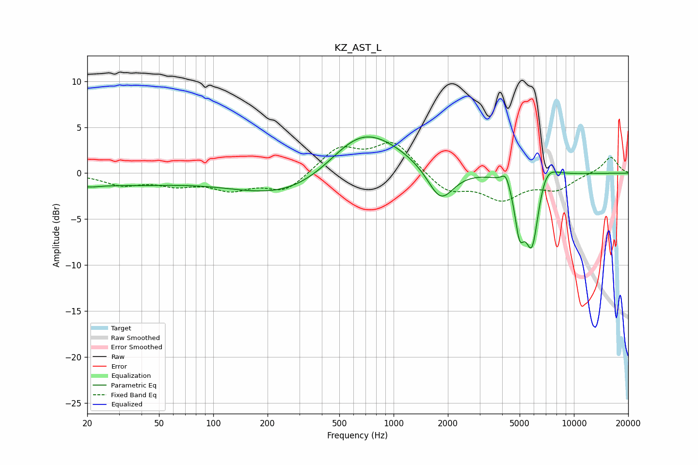

# KZ_AST_L
See [usage instructions](https://github.com/jaakkopasanen/AutoEq#usage) for more options and info.

### Parametric EQs
Apply preamp of -4.0 dB when using parametric equalizer.

|   # | Type    |   Fc (Hz) |    Q |   Gain (dB) |
|-----|---------|-----------|------|-------------|
|   1 | Peaking |        20 | 2.15 |        -0.5 |
|   2 | Peaking |        32 | 0.45 |        -1.1 |
|   3 | Peaking |       342 | 0.41 |        -3.9 |
|   4 | Peaking |       626 | 0.88 |         1.8 |
|   5 | Peaking |       697 | 0.59 |         5.1 |
|   6 | Peaking |      1823 | 1.94 |        -3.9 |
|   7 | Peaking |      4196 | 5.87 |         1.4 |
|   8 | Peaking |      4992 | 5.31 |        -4.7 |
|   9 | Peaking |      5859 | 3.39 |        -8.4 |
|  10 | Peaking |      6897 | 2.32 |         2.5 |

### Fixed Band EQs
When using fixed band (also called graphic) equalizer, apply preamp of **-3.4 dB** (if available) and set gains manually with these parameters.

|   # | Type    |   Fc (Hz) |    Q |   Gain (dB) |
|-----|---------|-----------|------|-------------|
|   1 | Peaking |        31 | 1.41 |        -1.2 |
|   2 | Peaking |        62 | 1.41 |        -1.1 |
|   3 | Peaking |       125 | 1.41 |        -1.6 |
|   4 | Peaking |       250 | 1.41 |        -2   |
|   5 | Peaking |       500 | 1.41 |         2.7 |
|   6 | Peaking |      1000 | 1.41 |         3.3 |
|   7 | Peaking |      2000 | 1.41 |        -2   |
|   8 | Peaking |      4000 | 1.41 |        -2.6 |
|   9 | Peaking |      8000 | 1.41 |        -1.6 |
|  10 | Peaking |     16000 | 1.41 |         1.8 |

### Graphs

