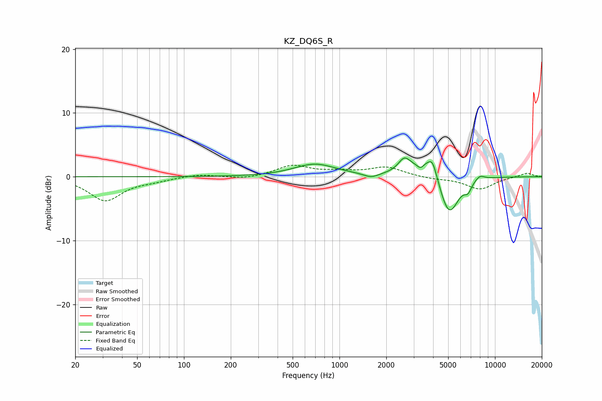

# KZ_DQ6S_R
See [usage instructions](https://github.com/jaakkopasanen/AutoEq#usage) for more options and info.

### Parametric EQs
Apply preamp of -3.0 dB when using parametric equalizer.

|   # | Type    |   Fc (Hz) |    Q |   Gain (dB) |
|-----|---------|-----------|------|-------------|
|   1 | Peaking |       695 | 1.05 |         1.9 |
|   2 | Peaking |      1597 | 2.96 |        -0.7 |
|   3 | Peaking |      2612 | 3.68 |         2   |
|   4 | Peaking |      3322 | 6    |        -1   |
|   5 | Peaking |      3837 | 1.55 |         4.1 |
|   6 | Peaking |      3970 | 6    |         1.5 |
|   7 | Peaking |      4800 | 1.98 |        -2.8 |
|   8 | Peaking |      5101 | 2.32 |        -4.9 |
|   9 | Peaking |      6703 | 6    |        -1.3 |
|  10 | Peaking |      7993 | 4.44 |         0.8 |

### Fixed Band EQs
When using fixed band (also called graphic) equalizer, apply preamp of **-1.9 dB** (if available) and set gains manually with these parameters.

|   # | Type    |   Fc (Hz) |    Q |   Gain (dB) |
|-----|---------|-----------|------|-------------|
|   1 | Peaking |        31 | 1.41 |        -3.7 |
|   2 | Peaking |        62 | 1.41 |        -0.5 |
|   3 | Peaking |       125 | 1.41 |         0.4 |
|   4 | Peaking |       250 | 1.41 |        -0.4 |
|   5 | Peaking |       500 | 1.41 |         1.7 |
|   6 | Peaking |      1000 | 1.41 |         0.6 |
|   7 | Peaking |      2000 | 1.41 |         1.5 |
|   8 | Peaking |      4000 | 1.41 |        -0.3 |
|   9 | Peaking |      8000 | 1.41 |        -1.9 |
|  10 | Peaking |     16000 | 1.41 |         0.6 |

### Graphs

