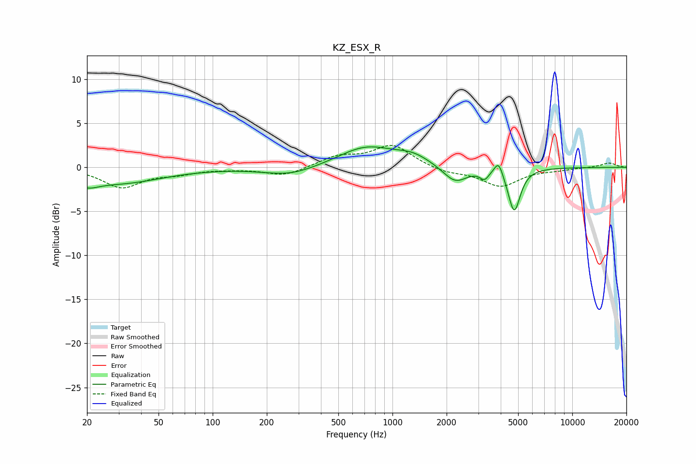

# KZ_ESX_R
See [usage instructions](https://github.com/jaakkopasanen/AutoEq#usage) for more options and info.

### Parametric EQs
Apply preamp of -2.4 dB when using parametric equalizer.

|   # | Type    |   Fc (Hz) |    Q |   Gain (dB) |
|-----|---------|-----------|------|-------------|
|   1 | Peaking |        20 | 2.25 |        -1   |
|   2 | Peaking |        31 | 0.6  |        -1.7 |
|   3 | Peaking |       269 | 0.98 |        -1   |
|   4 | Peaking |       713 | 0.91 |         2.3 |
|   5 | Peaking |      1298 | 1.45 |         1.1 |
|   6 | Peaking |      2233 | 2.08 |        -1.9 |
|   7 | Peaking |      3224 | 6    |        -0.6 |
|   8 | Peaking |      3285 | 6    |        -0.3 |
|   9 | Peaking |      3893 | 6    |         1.6 |
|  10 | Peaking |      4754 | 4.19 |        -5   |

### Fixed Band EQs
When using fixed band (also called graphic) equalizer, apply preamp of **-2.6 dB** (if available) and set gains manually with these parameters.

|   # | Type    |   Fc (Hz) |    Q |   Gain (dB) |
|-----|---------|-----------|------|-------------|
|   1 | Peaking |        31 | 1.41 |        -2.2 |
|   2 | Peaking |        62 | 1.41 |        -0.6 |
|   3 | Peaking |       125 | 1.41 |        -0.1 |
|   4 | Peaking |       250 | 1.41 |        -1   |
|   5 | Peaking |       500 | 1.41 |         1.2 |
|   6 | Peaking |      1000 | 1.41 |         2.5 |
|   7 | Peaking |      2000 | 1.41 |        -0.6 |
|   8 | Peaking |      4000 | 1.41 |        -2.1 |
|   9 | Peaking |      8000 | 1.41 |        -0.2 |
|  10 | Peaking |     16000 | 1.41 |         0.5 |

### Graphs

