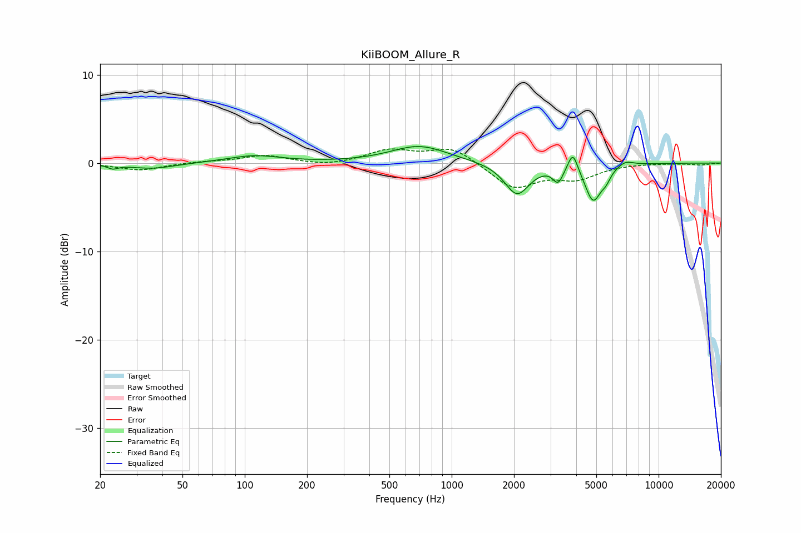

# KiiBOOM_Allure_R
See [usage instructions](https://github.com/jaakkopasanen/AutoEq#usage) for more options and info.

### Parametric EQs
Apply preamp of -2.0 dB when using parametric equalizer.

|   # | Type    |   Fc (Hz) |    Q |   Gain (dB) |
|-----|---------|-----------|------|-------------|
|   1 | Peaking |        23 | 5.81 |        -0.4 |
|   2 | Peaking |        36 | 1.28 |        -0.6 |
|   3 | Peaking |       111 | 1.1  |         0.8 |
|   4 | Peaking |       697 | 1.03 |         1.9 |
|   5 | Peaking |      2070 | 2.37 |        -3.6 |
|   6 | Peaking |      3268 | 5.78 |        -1.7 |
|   7 | Peaking |      3852 | 6    |         2.3 |
|   8 | Peaking |      4826 | 3.6  |        -4.1 |
|   9 | Peaking |      5571 | 5.99 |        -0.9 |
|  10 | Peaking |      6902 | 3.61 |         0.6 |

### Fixed Band EQs
When using fixed band (also called graphic) equalizer, apply preamp of **-1.7 dB** (if available) and set gains manually with these parameters.

|   # | Type    |   Fc (Hz) |    Q |   Gain (dB) |
|-----|---------|-----------|------|-------------|
|   1 | Peaking |        31 | 1.41 |        -0.8 |
|   2 | Peaking |        62 | 1.41 |         0.1 |
|   3 | Peaking |       125 | 1.41 |         0.9 |
|   4 | Peaking |       250 | 1.41 |        -0.4 |
|   5 | Peaking |       500 | 1.41 |         1.4 |
|   6 | Peaking |      1000 | 1.41 |         1.8 |
|   7 | Peaking |      2000 | 1.41 |        -2.8 |
|   8 | Peaking |      4000 | 1.41 |        -1.6 |
|   9 | Peaking |      8000 | 1.41 |         0   |
|  10 | Peaking |     16000 | 1.41 |        -0.2 |

### Graphs

