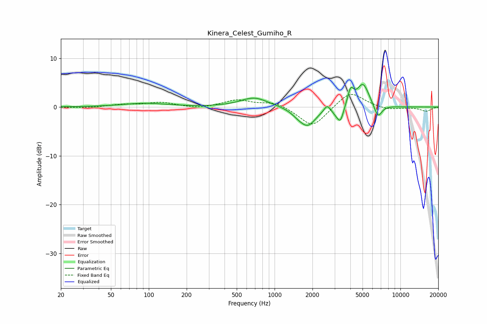

# Kinera_Celest_Gumiho_R
See [usage instructions](https://github.com/jaakkopasanen/AutoEq#usage) for more options and info.

### Parametric EQs
Apply preamp of -4.7 dB when using parametric equalizer.

|   # | Type    |   Fc (Hz) |    Q |   Gain (dB) |
|-----|---------|-----------|------|-------------|
|   1 | Peaking |        93 | 0.8  |         0.8 |
|   2 | Peaking |       689 | 1.3  |         2   |
|   3 | Peaking |      1517 | 2.81 |        -0.7 |
|   4 | Peaking |      1833 | 2.15 |        -3.7 |
|   5 | Peaking |      2612 | 5.93 |         1.3 |
|   6 | Peaking |      3067 | 4.69 |        -0.9 |
|   7 | Peaking |      3338 | 5.67 |        -2.9 |
|   8 | Peaking |      4024 | 5.96 |         3.1 |
|   9 | Peaking |      5042 | 2.82 |         4.8 |
|  10 | Peaking |      6626 | 4.33 |        -2.8 |

### Fixed Band EQs
When using fixed band (also called graphic) equalizer, apply preamp of **-2.7 dB** (if available) and set gains manually with these parameters.

|   # | Type    |   Fc (Hz) |    Q |   Gain (dB) |
|-----|---------|-----------|------|-------------|
|   1 | Peaking |        31 | 1.41 |        -0.2 |
|   2 | Peaking |        62 | 1.41 |         0.5 |
|   3 | Peaking |       125 | 1.41 |         0.9 |
|   4 | Peaking |       250 | 1.41 |        -0.4 |
|   5 | Peaking |       500 | 1.41 |         1.4 |
|   6 | Peaking |      1000 | 1.41 |         1.1 |
|   7 | Peaking |      2000 | 1.41 |        -4.2 |
|   8 | Peaking |      4000 | 1.41 |         3.3 |
|   9 | Peaking |      8000 | 1.41 |        -0.6 |
|  10 | Peaking |     16000 | 1.41 |        -0.8 |

### Graphs

